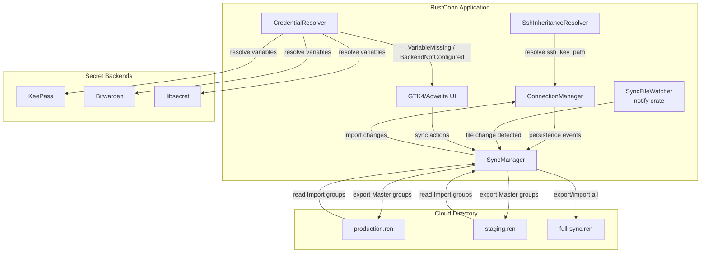
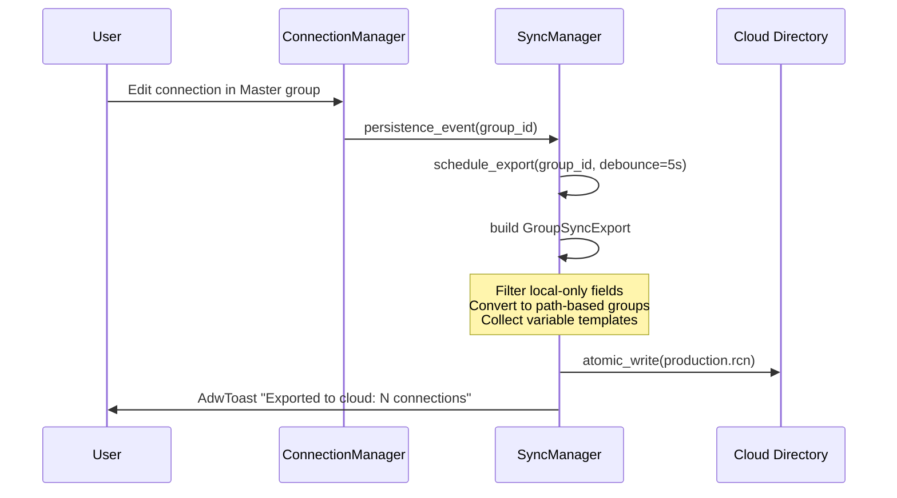
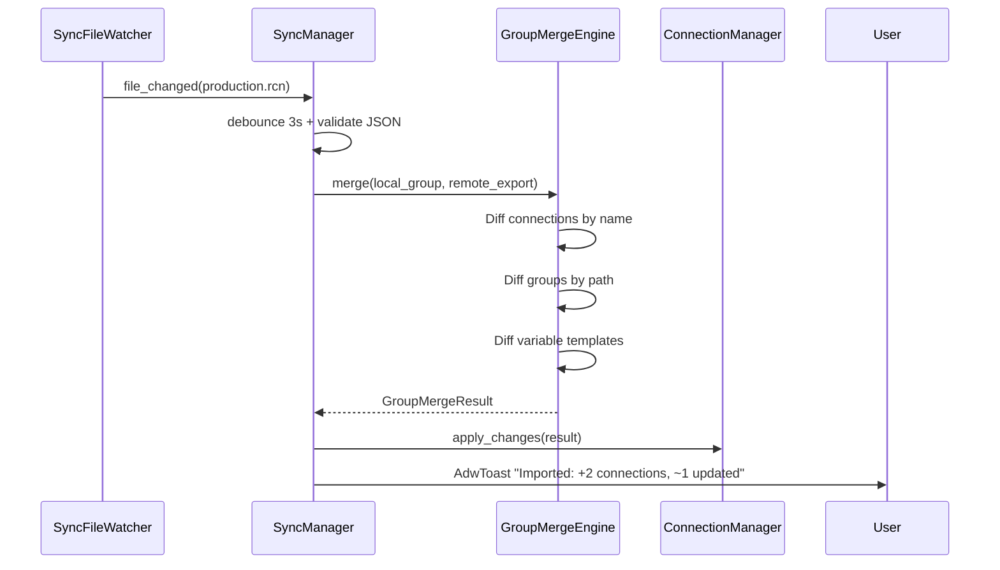
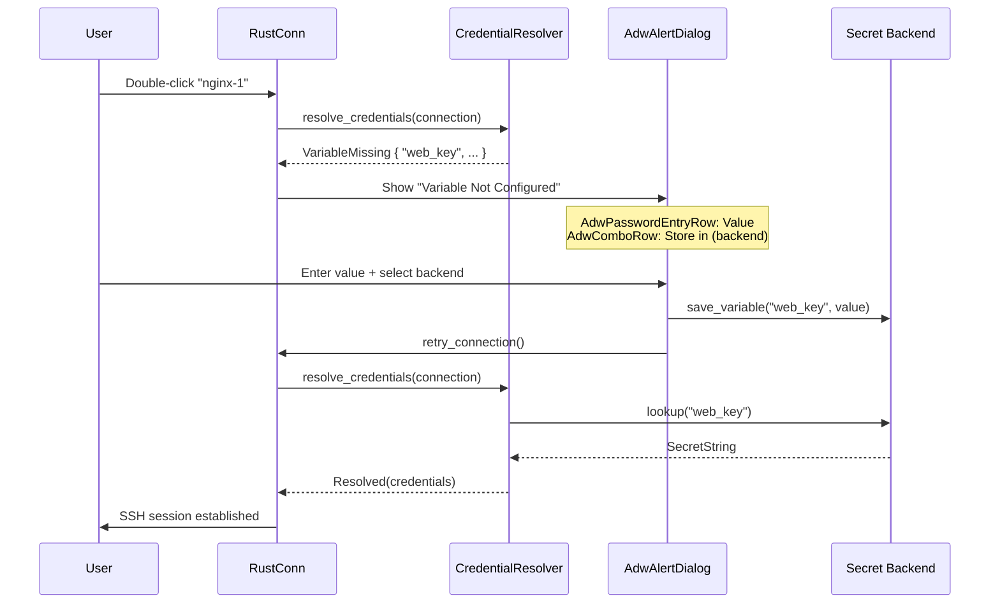
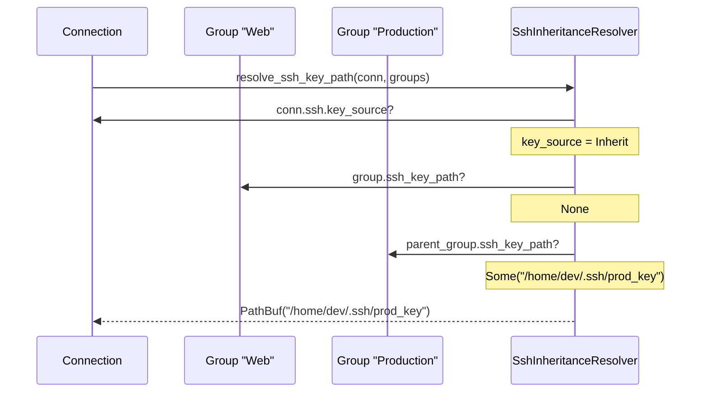

# Design Document: Cloud Sync

> Primary reference: `#[[file:docs/CLOUD_SYNC_DESIGN.md]]`

## Overview

Cloud Sync enables synchronization of RustConn connection configurations between devices and team members through a shared cloud directory (Google Drive, Syncthing, Nextcloud, Dropbox, USB — any file-syncing service).

Two sync modes address distinct use cases. **Group Sync** targets team collaboration: each root group exports to a dedicated `.rcn` file using a Master/Import access model with name-based merge. **Simple Sync** targets personal multi-device use: a single file contains all data with UUID-based bidirectional merge and tombstones for deletion tracking.

Two prerequisite features underpin the sync system. **SSH Key Inheritance** (Phase 0) adds group-level SSH settings with an inheritance chain so that `ssh_key_path` remains local-only per device. **Credential Resolution UX** (Phase 4) introduces `AdwAlertDialog`-based prompts when variables or secret backends are missing at connect time, replacing silent `warn` logs with actionable UI.

## Architecture



## Sequence Diagrams

### Group Sync: Master Export Flow



### Group Sync: Import Flow



### Credential Resolution at Connect Time



### SSH Key Inheritance Resolution



## Components and Interfaces

### Component 1: SyncManager

**Purpose**: Coordinates all sync operations — export scheduling, import triggering, file watcher management, and sync state tracking.

```rust
pub struct SyncManager {
    settings: SyncSettings,
    watcher: Option<SyncFileWatcher>,
    export_scheduler: ExportScheduler,
    state: HashMap<Uuid, GroupSyncState>,
}

impl SyncManager {
    pub fn new(settings: SyncSettings) -> Self;
    pub fn export_group(&self, group_id: Uuid, conn_mgr: &ConnectionManager) -> Result<SyncReport, SyncError>;
    pub fn schedule_export(&self, group_id: Uuid);
    pub fn import_group(&self, file: &Path, conn_mgr: &mut ConnectionManager) -> Result<SyncReport, SyncError>;
    pub fn import_all_on_start(&self, conn_mgr: &mut ConnectionManager) -> Vec<SyncReport>;
    pub fn list_available_sync_files(&self) -> Result<Vec<PathBuf>, SyncError>;
    pub fn enable_master(&self, group_id: Uuid, conn_mgr: &ConnectionManager) -> Result<(), SyncError>;
    pub fn enable_import(&self, file: &Path, conn_mgr: &mut ConnectionManager) -> Result<(), SyncError>;
    pub fn disable_sync(&self, group_id: Uuid, conn_mgr: &mut ConnectionManager) -> Result<(), SyncError>;
}
```

**Responsibilities**:
- Debounced export scheduling (5s) via watch channel
- Atomic file writes to sync directory
- File watcher lifecycle management
- Per-group sync state tracking (last_synced_at, errors)
- Filtering Master group events from watcher to prevent circular sync

### Component 2: GroupMergeEngine

**Purpose**: Name-based merge algorithm for Group Sync Import mode. Computes a diff between local group tree and remote `GroupSyncExport`.

```rust
pub struct GroupMergeEngine;

impl GroupMergeEngine {
    pub fn merge(
        local_groups: &[ConnectionGroup],
        local_connections: &[Connection],
        remote: &GroupSyncExport,
    ) -> GroupMergeResult;
}

pub struct GroupMergeResult {
    pub connections_to_create: Vec<SyncConnection>,
    pub connections_to_update: Vec<(Uuid, SyncConnection)>,
    pub connections_to_delete: Vec<Uuid>,
    pub groups_to_create: Vec<SyncGroup>,
    pub groups_to_delete: Vec<Uuid>,
    pub variables_to_create: Vec<VariableTemplate>,
}
```

**Responsibilities**:
- Diff connections by name within group (create/update/delete)
- Diff subgroups by path (create/delete)
- Preserve local-only fields during update (sort_order, is_pinned, window_geometry, ssh_key_path, last_connected)
- Create missing variable templates
- Respect `updated_at` timestamps for conflict resolution

### Component 3: FullMergeEngine

**Purpose**: UUID-based bidirectional merge for Simple Sync with tombstone support.

```rust
pub struct FullMergeEngine;

impl FullMergeEngine {
    pub fn merge(
        local: &LocalState,
        remote: &FullSyncExport,
    ) -> FullMergeResult;
}
```

**Responsibilities**:
- UUID + `updated_at` merge for all entity types
- Tombstone processing (deleted_at > updated_at → skip)
- Tombstone cleanup after retention_days
- device_id check to prevent circular sync

### Component 4: SshInheritanceResolver

**Purpose**: Resolves SSH settings by walking the group hierarchy from connection up to root.

```rust
pub fn resolve_ssh_key_path(
    connection: &Connection,
    groups: &[ConnectionGroup],
) -> Option<PathBuf>;

pub fn resolve_ssh_auth_method(
    connection: &Connection,
    groups: &[ConnectionGroup],
) -> SshAuthMethod;

pub fn resolve_ssh_proxy_jump(
    connection: &Connection,
    groups: &[ConnectionGroup],
) -> Option<String>;

pub fn resolve_ssh_agent_socket(
    connection: &Connection,
    groups: &[ConnectionGroup],
) -> Option<String>;
```

**Responsibilities**:
- Walk group chain: Connection → Group → Parent Group → ... → Root
- Return first `Some` value found in the chain
- Handle `SshKeySource::Inherit` variant
- Cycle detection (malformed parent_id chains)

### Component 5: CredentialResolver (enhanced)

**Purpose**: Pre-connect credential resolution that returns actionable results instead of silent `None`.

```rust
pub enum CredentialResolutionResult {
    Resolved(Credentials),
    NotNeeded,
    VariableMissing {
        variable_name: String,
        description: Option<String>,
        is_secret: bool,
    },
    BackendNotConfigured {
        required_backend: SecretBackendType,
    },
    VaultEntryMissing {
        connection_name: String,
        lookup_key: String,
    },
}
```

**Responsibilities**:
- Classify missing credentials into specific actionable types
- Enable UI layer to show appropriate `AdwAlertDialog`
- Support retry-after-save flow

### Component 6: SyncFileWatcher

**Purpose**: Monitors sync directory for `.rcn` file changes using the `notify` crate.

```rust
pub struct SyncFileWatcher {
    watcher: RecommendedWatcher,
    debounce_tx: Sender<PathBuf>,
}

impl SyncFileWatcher {
    pub fn new(sync_dir: PathBuf, callback: impl Fn(PathBuf) + Send + 'static) -> Result<Self, SyncError>;
    pub fn stop(&mut self);
}
```

**Responsibilities**:
- inotify/kqueue-based file watching via `notify` crate
- 3-second debounce to handle partial writes from cloud clients
- Filter events for Master groups (prevent circular export→import)
- JSON validation before triggering import

## Data Models

### SyncSettings

```rust
pub struct SyncSettings {
    pub sync_dir: Option<PathBuf>,
    pub device_id: Uuid,
    pub device_name: String,
    pub auto_import_on_start: bool,
    pub export_debounce_secs: u32,
    pub tombstone_retention_days: u32,
}
```

**Validation Rules**:
- `sync_dir`: Must exist and be writable when set
- `device_name`: Non-empty, defaults to hostname
- `export_debounce_secs`: Range 1..=60, default 5
- `tombstone_retention_days`: Range 1..=365, default 30

### SyncMode (added to ConnectionGroup)

```rust
pub enum SyncMode {
    None,
    Master,
    Import,
}
```

New fields on `ConnectionGroup`:
- `sync_mode: SyncMode` — default `None`
- `sync_file: Option<String>` — filename in sync_dir (e.g., `"production-servers.rcn"`)
- `last_synced_at: Option<DateTime<Utc>>`

### GroupSyncExport (file format)

```rust
pub struct GroupSyncExport {
    pub sync_version: u32,           // 1
    pub sync_type: String,           // "group"
    pub exported_at: DateTime<Utc>,
    pub app_version: String,
    pub master_device_id: Uuid,
    pub master_device_name: String,
    pub root_group: SyncGroup,
    pub groups: Vec<SyncGroup>,
    pub connections: Vec<SyncConnection>,
    pub variable_templates: Vec<VariableTemplate>,
}
```

### SyncConnection

```rust
pub struct SyncConnection {
    pub name: String,                          // PRIMARY KEY for merge
    pub group_path: String,                    // e.g. "Production Servers/Web"
    pub host: String,
    pub port: u16,
    pub protocol: ProtocolType,
    pub username: Option<String>,
    pub description: Option<String>,
    pub tags: Vec<String>,
    pub protocol_config: ProtocolConfig,
    pub password_source: PasswordSource,       // Variable names only
    pub automation: AutomationConfig,
    pub custom_properties: Vec<CustomProperty>,
    pub pre_connect_task: Option<ConnectionTask>,
    pub post_disconnect_task: Option<ConnectionTask>,
    pub wol_config: Option<WolConfig>,
    pub icon: Option<String>,
    pub highlight_rules: Vec<HighlightRule>,
    pub updated_at: DateTime<Utc>,
}
```

**Excluded local-only fields**: `last_connected`, `sort_order`, `is_pinned`, `pin_order`, `window_geometry`, `window_mode`, `remember_window_position`, `skip_port_check`, `ssh_key_path`, `expanded` (group), `group sort_order`.

### SyncGroup

```rust
pub struct SyncGroup {
    pub name: String,
    pub path: String,                          // hierarchical path
    pub description: Option<String>,
    pub icon: Option<String>,
    pub username: Option<String>,
    pub domain: Option<String>,
    pub ssh_auth_method: Option<SshAuthMethod>,
    pub ssh_proxy_jump: Option<String>,
}
```

### VariableTemplate

```rust
pub struct VariableTemplate {
    pub name: String,
    pub description: Option<String>,
    pub is_secret: bool,
    pub default_value: Option<String>,  // only for non-secret
}
```

### FullSyncExport (Simple Sync file format)

```rust
pub struct FullSyncExport {
    pub sync_version: u32,
    pub sync_type: String,           // "full"
    pub exported_at: DateTime<Utc>,
    pub app_version: String,
    pub device_id: Uuid,
    pub device_name: String,
    pub connections: Vec<Connection>,
    pub groups: Vec<ConnectionGroup>,
    pub templates: Vec<ConnectionTemplate>,
    pub snippets: Vec<Snippet>,
    pub clusters: Vec<Cluster>,
    pub variables: Vec<Variable>,    // non-secret only
    pub tombstones: Vec<Tombstone>,
}
```

### Tombstone

```rust
pub struct Tombstone {
    pub entity_type: SyncEntityType,
    pub id: Uuid,
    pub deleted_at: DateTime<Utc>,
}

pub enum SyncEntityType {
    Connection,
    Group,
    Template,
    Snippet,
    Cluster,
    Variable,
}
```

### SshKeySource (extended)

```rust
pub enum SshKeySource {
    File { path: PathBuf },
    Agent { fingerprint: String, comment: String },
    Default,
    Inherit,  // NEW: inherit from parent group
}
```

### SyncReport

```rust
pub struct SyncReport {
    pub group_name: String,
    pub connections_added: usize,
    pub connections_updated: usize,
    pub connections_removed: usize,
    pub groups_added: usize,
    pub groups_removed: usize,
    pub variables_created: usize,
    pub timestamp: DateTime<Utc>,
}
```


## Key Functions with Formal Specifications

### Function 1: GroupMergeEngine::merge()

```rust
pub fn merge(
    local_groups: &[ConnectionGroup],
    local_connections: &[Connection],
    remote: &GroupSyncExport,
) -> GroupMergeResult
```

**Preconditions:**
- `remote.sync_version` is supported (currently 1)
- `remote.sync_type == "group"`
- All `remote.connections` have non-empty `name` fields
- All `remote.connections` have valid `group_path` referencing a group in `remote.groups` or `remote.root_group`
- Connection names are unique within each group_path in `remote.connections`

**Postconditions:**
- Every connection in `remote.connections` not present locally (by name+group_path) appears in `connections_to_create`
- Every local connection not present in `remote.connections` (by name) appears in `connections_to_delete`
- Every connection present in both where `remote.updated_at > local.updated_at` appears in `connections_to_update`
- Updated connections preserve local-only fields: `sort_order`, `is_pinned`, `pin_order`, `window_geometry`, `window_mode`, `last_connected`, `ssh_key_path`
- `|connections_to_create| + |connections_to_update| + |connections_to_delete| + unchanged == max(|local|, |remote|)` (no duplicates, no losses)
- Every variable in `remote.variable_templates` not present locally appears in `variables_to_create`

**Loop Invariants:**
- For connection diff loop: all previously processed connections have been classified into exactly one of create/update/delete/unchanged
- For group diff loop: all previously processed paths have been classified into exactly one of create/delete/unchanged

### Function 2: FullMergeEngine::merge()

```rust
pub fn merge(
    local: &LocalState,
    remote: &FullSyncExport,
) -> FullMergeResult
```

**Preconditions:**
- `remote.sync_version` is supported
- `remote.sync_type == "full"`
- `remote.device_id != local.device_id` (not self-sync)
- All entities have valid UUIDs

**Postconditions:**
- For each remote entity: if `entity.id` in local tombstones AND `tombstone.deleted_at > entity.updated_at` → entity is skipped
- For each remote entity: if `entity.id` in local AND `local.updated_at >= remote.updated_at` → local kept
- For each remote entity: if `entity.id` in local AND `remote.updated_at > local.updated_at` → local updated from remote (preserving local-only fields)
- For each remote entity: if `entity.id` not in local AND not in local tombstones → entity added
- For each local entity: if `entity.id` in remote tombstones AND `tombstone.deleted_at > entity.updated_at` → entity deleted locally
- Tombstones older than `retention_days` are removed from result
- No secret variable values appear in the merged output

**Loop Invariants:**
- For each entity type loop: all previously processed entities maintain referential integrity (group_id references valid groups)
- Tombstone set is monotonically decreasing (only cleanup removes entries)

### Function 3: resolve_ssh_key_path()

```rust
pub fn resolve_ssh_key_path(
    connection: &Connection,
    groups: &[ConnectionGroup],
) -> Option<PathBuf>
```

**Preconditions:**
- `connection` is a valid Connection with optional `group_id`
- `groups` contains all groups in the hierarchy (no missing parents)

**Postconditions:**
- If `connection.protocol_config.ssh.key_source` is `File { path }` → returns `Some(path)`
- If `connection.protocol_config.ssh.key_source` is `Inherit` or key_path is None → walks group chain
- Returns the first `Some(ssh_key_path)` found in the group chain from immediate parent to root
- If no group in the chain has `ssh_key_path` set → returns `None`
- Function terminates even if group hierarchy has cycles (visited set)

**Loop Invariants:**
- `visited` set contains all group IDs examined so far
- Current group is not in `visited` (cycle detection)
- Each iteration moves strictly closer to root (parent_id chain)

### Function 4: export_group()

```rust
pub fn export_group(
    &self,
    group_id: Uuid,
    conn_mgr: &ConnectionManager,
) -> Result<SyncReport, SyncError>
```

**Preconditions:**
- `group_id` references a root group (parent_id is None)
- Group has `sync_mode == Master`
- `self.settings.sync_dir` is Some and the directory exists and is writable
- Group has `sync_file` set (filename determined at first export)

**Postconditions:**
- A valid JSON file is written atomically to `sync_dir/sync_file`
- File contains all connections and subgroups of the root group
- No local-only fields appear in the exported file
- No secret variable values appear in the exported file (only variable names)
- `SyncReport` accurately reflects counts of exported entities
- Group's `last_synced_at` is updated to current time

**Loop Invariants:** N/A (single atomic operation)

### Function 5: group_name_to_filename()

```rust
pub fn group_name_to_filename(name: &str) -> String
```

**Preconditions:**
- `name` is a non-empty string

**Postconditions:**
- Result contains only ASCII lowercase alphanumeric characters and hyphens
- Result ends with `.rcn`
- Unicode characters are transliterated to ASCII equivalents
- Special characters are replaced with hyphens
- Consecutive hyphens are collapsed to single hyphen
- Leading/trailing hyphens are removed
- Result is deterministic: same input always produces same output

## Algorithmic Pseudocode

### Group Sync Merge Algorithm (Import Mode)

```pascal
ALGORITHM GroupMerge(local_groups, local_connections, remote)
INPUT: local_groups: [ConnectionGroup], local_connections: [Connection], remote: GroupSyncExport
OUTPUT: GroupMergeResult

BEGIN
  result ← empty GroupMergeResult

  // Phase 1: Merge groups by path
  remote_paths ← {g.path FOR g IN remote.groups}
  local_paths ← {compute_path(g) FOR g IN local_groups WHERE g IS subgroup}

  FOR EACH path IN (remote_paths - local_paths) DO
    ASSERT path NOT IN local_paths
    result.groups_to_create.add(remote.group_at(path))
  END FOR

  FOR EACH path IN (local_paths - remote_paths) DO
    ASSERT path NOT IN remote_paths
    result.groups_to_delete.add(local_group_id_at(path))
  END FOR

  // Phase 2: Merge connections by name within group
  remote_by_name ← index remote.connections BY (name, group_path)
  local_by_name ← index local_connections BY (name, group_path)

  FOR EACH (name, path) IN remote_by_name.keys DO
    IF (name, path) NOT IN local_by_name THEN
      result.connections_to_create.add(remote_by_name[(name, path)])
    ELSE
      local_conn ← local_by_name[(name, path)]
      remote_conn ← remote_by_name[(name, path)]
      IF remote_conn.updated_at > local_conn.updated_at THEN
        result.connections_to_update.add((local_conn.id, remote_conn))
        // Preserve: sort_order, is_pinned, window_geometry,
        //           last_connected, ssh_key_path
      END IF
    END IF
  END FOR

  FOR EACH (name, path) IN local_by_name.keys DO
    IF (name, path) NOT IN remote_by_name THEN
      result.connections_to_delete.add(local_by_name[(name, path)].id)
    END IF
  END FOR

  // Phase 3: Variable templates
  FOR EACH var IN remote.variable_templates DO
    IF NOT exists_locally(var.name) THEN
      result.variables_to_create.add(var)
    END IF
  END FOR

  RETURN result
END
```

### Simple Sync Bidirectional Merge Algorithm

```pascal
ALGORITHM FullMerge(local, remote)
INPUT: local: LocalState, remote: FullSyncExport
OUTPUT: FullMergeResult

BEGIN
  ASSERT remote.device_id ≠ local.device_id

  result ← empty FullMergeResult

  // Process each entity type: connections, groups, templates, snippets, clusters
  FOR EACH entity_type IN [Connection, Group, Template, Snippet, Cluster] DO

    remote_items ← remote.items_of(entity_type)
    local_items ← local.items_of(entity_type)
    local_tombstones ← local.tombstones_of(entity_type)
    remote_tombstones ← remote.tombstones_of(entity_type)

    // Remote → Local reconciliation
    FOR EACH item IN remote_items DO
      IF item.id IN local_tombstones
         AND local_tombstones[item.id].deleted_at > item.updated_at THEN
        CONTINUE  // deleted locally after last remote update
      ELSE IF item.id IN local_items THEN
        IF local_items[item.id].updated_at ≥ item.updated_at THEN
          CONTINUE  // local is same or newer
        ELSE
          result.to_update.add((item.id, item))  // remote is newer
        END IF
      ELSE
        result.to_create.add(item)  // new from remote
      END IF
    END FOR

    // Apply remote tombstones locally
    FOR EACH tombstone IN remote_tombstones DO
      IF tombstone.id IN local_items
         AND tombstone.deleted_at > local_items[tombstone.id].updated_at THEN
        result.to_delete.add(tombstone.id)
      END IF
    END FOR

  END FOR

  // Cleanup old tombstones
  cutoff ← now() - retention_days
  result.tombstones_to_remove ← {t FOR t IN all_tombstones WHERE t.deleted_at < cutoff}

  RETURN result
END
```

### SSH Key Inheritance Resolution Algorithm

```pascal
ALGORITHM ResolveSshKeyPath(connection, groups)
INPUT: connection: Connection, groups: [ConnectionGroup]
OUTPUT: Option<PathBuf>

BEGIN
  // Check connection-level setting first
  ssh_config ← connection.protocol_config.ssh
  IF ssh_config IS NOT NULL THEN
    MATCH ssh_config.key_source WITH
      | File { path } → RETURN Some(path)
      | Agent { .. }  → RETURN None  // agent handles keys
      | Default       → RETURN None  // use SSH default
      | Inherit       → // fall through to group chain
    END MATCH
  END IF

  // Walk group hierarchy
  visited ← empty Set<Uuid>
  current_group_id ← connection.group_id

  WHILE current_group_id IS Some(gid) DO
    ASSERT gid NOT IN visited  // cycle detection
    IF gid IN visited THEN
      RETURN None  // break cycle
    END IF
    visited.add(gid)

    group ← find_group(gid, groups)
    IF group IS None THEN
      RETURN None  // orphaned reference
    END IF

    IF group.ssh_key_path IS Some(path) THEN
      RETURN Some(path)
    END IF

    current_group_id ← group.parent_id
  END WHILE

  RETURN None  // no key found in chain
END
```

## Example Usage

### Enabling Master Sync on a Group

```rust
// User enables Cloud Sync as Master on "Production Servers" group
let group_id = production_group.id;

// 1. Set sync mode
conn_mgr.update_group_sync_mode(group_id, SyncMode::Master)?;

// 2. Generate filename (fixed at first export)
let filename = group_name_to_filename(&production_group.name);
// "production-servers.rcn"
conn_mgr.update_group_sync_file(group_id, Some(filename.clone()))?;

// 3. Initial export
let report = sync_manager.export_group(group_id, &conn_mgr)?;
// SyncReport { connections_added: 47, groups_added: 5, ... }

// 4. Subsequent edits trigger debounced export automatically
conn_mgr.update_connection(conn_id, updated_conn)?;
// → SyncManager receives persistence event
// → schedule_export(group_id) with 5s debounce
```

### Importing a Group from Cloud

```rust
// User clicks "Import" on "qa-servers.rcn" in Settings
let file = sync_dir.join("qa-servers.rcn");

// 1. Parse and validate
let export = GroupSyncExport::from_file(&file)?;

// 2. Create Import group
let report = sync_manager.import_group(&file, &mut conn_mgr)?;
// Creates root group with SyncMode::Import
// Creates subgroups and connections
// Creates variable templates (empty values)

// 3. File watcher auto-imports future changes
// SyncFileWatcher detects qa-servers.rcn change → auto-import
```

### SSH Key Inheritance in Practice

```rust
// Group "Production" has ssh_key_path = Some("/home/dev/.ssh/prod_key")
// Subgroup "Web" has ssh_key_path = None
// Connection "nginx-1" in "Web" has key_source = Inherit

let key_path = resolve_ssh_key_path(&nginx_conn, &all_groups);
// Returns Some("/home/dev/.ssh/prod_key") — inherited from "Production"

// On admin's machine: Production.ssh_key_path = "/home/admin/.ssh/prod_key"
// On dev's machine:   Production.ssh_key_path = "/home/dev/.ssh/prod_key"
// ssh_key_path is LOCAL-ONLY — never synced
```

### Credential Resolution Flow

```rust
// Connection "nginx-1" has password_source = Variable("web_deploy_key")
// Variable "web_deploy_key" is not yet configured on this device

let result = credential_resolver.resolve(&nginx_conn);
match result {
    CredentialResolutionResult::VariableMissing { variable_name, description, is_secret } => {
        // Show AdwAlertDialog with AdwPasswordEntryRow + AdwComboRow
        // User enters value, selects backend
        // Save variable → retry connection
    }
    CredentialResolutionResult::BackendNotConfigured { required_backend } => {
        // Show AdwAlertDialog: "Enter Password Manually" / "Open Settings"
    }
    CredentialResolutionResult::Resolved(creds) => {
        // Proceed with connection
    }
    _ => {}
}
```

## Correctness Properties

The following properties must hold for all valid inputs:

**P1 — Group Merge Completeness**: For any Group Sync merge, every connection in the remote export is either created locally, updates an existing local connection, or matches an unchanged local connection. No remote connection is silently dropped.

**P2 — Group Merge No Data Loss (local-only fields)**: For any connection update during Group Sync import, the local-only fields (`sort_order`, `is_pinned`, `pin_order`, `window_geometry`, `window_mode`, `last_connected`, `ssh_key_path`, `skip_port_check`) are preserved from the local version.

**P3 — Group Merge Determinism**: Given the same local state and remote export, `GroupMergeEngine::merge()` always produces the same `GroupMergeResult`.

**P4 — No Secrets in Sync Files**: For any exported sync file (Group or Simple), no `SecretString` values, plaintext passwords, or secret variable values appear in the serialized output. Only variable names (via `PasswordSource::Variable(name)`) are included.

**P5 — SSH Inheritance Termination**: `resolve_ssh_key_path()` terminates for any group hierarchy, including cycles (via visited set). The function visits at most `|groups|` nodes.

**P6 — SSH Inheritance Correctness**: If a connection has `key_source = Inherit` and its nearest ancestor group with `ssh_key_path = Some(p)` is group G, then `resolve_ssh_key_path()` returns `Some(p)`. If no ancestor has `ssh_key_path` set, it returns `None`.

**P7 — Simple Sync Convergence**: After a full bidirectional merge between two devices (A exports, B imports, B exports, A imports), both devices have identical non-local-only data for all shared entities (assuming no concurrent edits during the sync cycle).

**P8 — Tombstone Consistency**: In Simple Sync, if device A deletes entity E at time T, and device B has entity E with `updated_at < T`, then after merge device B also deletes entity E.

**P9 — Atomic File Writes**: All sync file writes use atomic write (write to temp file + rename) so that readers never see partial/corrupt JSON.

**P10 — Import Group Immutability**: Connections in Import-mode groups cannot have their synced fields modified through the UI. Only local-only fields are editable.

**P11 — Slug Determinism**: `group_name_to_filename(name)` is a pure function — same input always produces same output, regardless of locale or system state.

**P12 — Circular Sync Prevention**: Master group export events do not trigger import on the same device. The file watcher filters events for groups where `sync_mode == Master`.

## Error Handling

### Error Scenario 1: Corrupt Sync File

**Condition**: Cloud client writes file partially, or file is manually corrupted
**Response**: JSON validation fails during parse; `SyncError::InvalidFormat` returned
**Recovery**: Log warning, show `AdwToast` with error message, skip this import cycle. File watcher continues monitoring for next valid write.

### Error Scenario 2: Sync Directory Unavailable

**Condition**: `sync_dir` is deleted, unmounted, or permissions changed during runtime
**Response**: `SyncError::DirectoryNotAccessible` on next export/import attempt
**Recovery**: Disable file watcher, show `AdwToast`. Sync resumes automatically when directory becomes available again.

### Error Scenario 3: Duplicate Connection Names

**Condition**: Two connections with the same name exist in the same group during Group Sync merge
**Response**: First occurrence wins; second is logged as warning
**Recovery**: Admin should rename duplicates in the Master group

### Error Scenario 4: Clock Skew Between Devices

**Condition**: `updated_at` timestamps are unreliable due to clock differences
**Response**: Merge uses timestamp comparison as-is (last-write-wins)
**Recovery**: NTP recommended in documentation. For Group Sync, Master is authoritative so clock skew is less impactful.

### Error Scenario 5: Variable Not Configured at Connect Time

**Condition**: Connection references a variable that has no value on this device
**Response**: `CredentialResolutionResult::VariableMissing` triggers `AdwAlertDialog`
**Recovery**: User enters value and selects backend → variable saved → connection retried automatically

### Error Scenario 6: Secret Backend Not Configured

**Condition**: Connection's password_source references a backend (KeePass, Bitwarden) that isn't set up
**Response**: `CredentialResolutionResult::BackendNotConfigured` triggers `AdwAlertDialog`
**Recovery**: User chooses "Enter Password Manually" (one-time) or "Open Settings" (configure backend)

### Error Scenario 7: Concurrent Master Exports

**Condition**: Two users both have Master mode on the same group (misconfiguration)
**Response**: Last-write-wins at the file level
**Recovery**: Documentation recommends single Master per group. Future: file-level locking or version vector.

## Testing Strategy

### Unit Testing Approach

- Serialization round-trip tests for all sync file formats (`GroupSyncExport`, `FullSyncExport`)
- Local-only field filtering: verify excluded fields don't appear in serialized output
- Slug generation: unicode, special characters, edge cases (empty after slugification)
- SSH inheritance: 1-level, 3-level, missing parent, cycle detection
- Credential resolution: all `CredentialResolutionResult` variants
- Merge engine: create/update/delete scenarios, empty inputs, single-item inputs

### Property-Based Testing Approach

**Property Test Library**: `proptest`

- **GroupMergeEngine**: For arbitrary local state and remote export, merge result classifies every connection into exactly one category (create/update/delete/unchanged) with no duplicates
- **FullMergeEngine**: For arbitrary bidirectional merge, convergence property holds after two full sync cycles
- **SSH Inheritance**: For arbitrary group hierarchies (including cycles), `resolve_ssh_key_path` terminates and returns consistent results
- **Slug generation**: For arbitrary Unicode strings, output is valid ASCII filename with `.rcn` extension
- **No secrets in export**: For arbitrary connection data with secret variables, serialized export contains no secret values

### Integration Testing Approach

- End-to-end Group Sync: export from Master → modify file → import to Import group → verify merge
- File watcher: write file → verify debounced callback fires → verify import triggered
- Credential resolution flow: mock secret backend → verify dialog triggers → verify retry
- Atomic writes: concurrent read during write → verify reader gets complete valid JSON or previous version

## Performance Considerations

- Sync files for 200 connections ≈ 50KB — well within cloud sync service limits
- Export debounce (5s) prevents rapid-fire writes during bulk edits
- File watcher debounce (3s) handles partial writes from cloud clients
- Buffered I/O (`BufReader`/`BufWriter`) for all file operations
- Progress indicator for first-time import of large groups (500+ connections)
- Tombstone cleanup prevents unbounded growth in Simple Sync files

## Security Considerations

- Credentials never appear in sync files — only variable names (`PasswordSource::Variable("name")`)
- `ssh_key_path` is local-only — never synced between devices
- `ssh_agent_socket` is local-only — never synced
- Secret variable values stored only in local secret backends (KeePass, Bitwarden, libsecret)
- Sync files may be readable by other team members — no sensitive data by design
- Atomic writes prevent partial reads of sync files
- File permissions: sync directory permissions managed by cloud client, not RustConn

## Dependencies

```toml
# New crates for rustconn-core:
notify = "7"       # File watching (inotify/kqueue)
hostname = "0.4"   # Default device name
slug = "0.1"       # File name generation from group names

# Already in project:
# chrono, uuid, serde, serde_json, tokio, tracing, thiserror, secrecy
```

## Module Structure

```
rustconn-core/src/sync/
├── mod.rs                — pub exports
├── settings.rs           — SyncSettings, SyncMode, ConflictStrategy
├── group_export.rs       — GroupSyncExport, SyncConnection, SyncGroup
├── full_export.rs        — FullSyncExport (Simple Sync)
├── group_merge.rs        — GroupMergeEngine (name-based)
├── full_merge.rs         — FullMergeEngine (UUID-based, tombstones)
├── variable_template.rs  — VariableTemplate model
├── tombstone.rs          — Tombstone model and cleanup
├── watcher.rs            — SyncFileWatcher (notify crate)
├── manager.rs            — SyncManager: coordination
├── state.rs              — Per-group sync state tracking
└── credential_check.rs   — CredentialResolutionResult, pre-connect checks

rustconn-core/src/connection/
└── ssh_inheritance.rs    — resolve_ssh_key_path, resolve_ssh_auth_method, etc.
```
