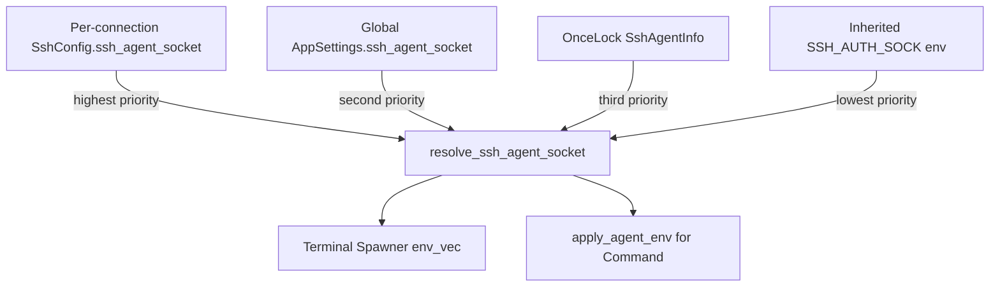

# Design Document: Custom SSH Agent Socket

## Overview

This feature adds two layers of SSH agent socket override to RustConn:

1. A **global setting** in `AppSettings` that overrides the auto-detected `SSH_AUTH_SOCK` for all connections.
2. A **per-connection setting** in `SshConfig` that overrides both the global setting and auto-detected socket for a specific connection.

The resolution follows a strict priority chain: per-connection → global setting → OnceLock agent info → inherited environment. This is critical for Flatpak users whose `SSH_AUTH_SOCK` is hard-overwritten by the runtime's `--socket=ssh-auth` flag, making it impossible to use alternative agents like KeePassXC or Bitwarden.

The implementation touches three crates (`rustconn-core`, `rustconn`, `rustconn-cli`) and the Flatpak manifests, but the core logic — a single `resolve_ssh_agent_socket()` function — lives in `rustconn-core` so both GUI and CLI can share it.

## Architecture



The resolution function is a pure function (no side effects) that takes the three optional override sources and returns `Option<String>`. Callers in the terminal spawner and `apply_agent_env()` use the result to set `SSH_AUTH_SOCK` on child processes.

### Design Decisions

1. **Resolution function in `rustconn-core/src/sftp.rs`**: Co-located with the existing `apply_agent_env()` and `SshAgentInfo` OnceLock. This avoids a new module and keeps all agent socket logic in one place.

2. **Global setting stored in `AppSettings` directly** (not in a nested struct): The setting is a single `Option<String>` field. Adding a new nested `SshAgentSettings` struct would be over-engineering for one field.

3. **Validation is advisory, not blocking**: Socket paths that don't exist on disk produce a warning, not an error. The socket may be created later (e.g., by starting KeePassXC after configuring the path). Only non-absolute paths produce a hard warning.

4. **`spawn_ssh` gains an optional `ssh_agent_socket` parameter**: Rather than threading the full `SshConfig` through the terminal spawner, we pass only the resolved socket path. This keeps the spawner's API minimal and avoids coupling it to the SSH model.

## Components and Interfaces

### 1. Resolution Function (`rustconn-core/src/sftp.rs`)

```rust
/// Resolves the SSH agent socket path using the priority chain:
/// per-connection → global setting → OnceLock agent info → None (inherit env).
///
/// Returns `Some(path)` if an override should be applied, `None` if the
/// child process should inherit `SSH_AUTH_SOCK` from the parent environment.
pub fn resolve_ssh_agent_socket(
    per_connection: Option<&str>,
    global_setting: Option<&str>,
) -> Option<String>
```

The function filters out empty strings internally, so callers don't need to distinguish `Some("")` from `None`.

### 2. Updated `apply_agent_env()` (`rustconn-core/src/sftp.rs`)

A new overload that accepts per-connection and global overrides:

```rust
/// Applies SSH_AUTH_SOCK to a Command using the priority chain.
pub fn apply_agent_env_with_overrides(
    cmd: &mut std::process::Command,
    per_connection: Option<&str>,
    global_setting: Option<&str>,
)
```

The existing `apply_agent_env()` remains unchanged for backward compatibility (it uses only the OnceLock).

### 3. `SshConfig` Field (`rustconn-core/src/models/protocol.rs`)

New optional field on `SshConfig`:

```rust
/// Custom SSH agent socket path override for this connection.
/// When set, overrides both the global setting and auto-detected socket.
#[serde(default, skip_serializing_if = "Option::is_none")]
pub ssh_agent_socket: Option<String>,
```

### 4. `AppSettings` Field (`rustconn-core/src/config/settings.rs`)

New optional field on `AppSettings`:

```rust
/// Global custom SSH agent socket path.
/// Overrides auto-detected SSH_AUTH_SOCK for all connections.
#[serde(default, skip_serializing_if = "Option::is_none")]
pub ssh_agent_socket: Option<String>,
```

### 5. Validation Function (`rustconn-core/src/sftp.rs`)

```rust
/// Validates a socket path and returns a validation result.
pub enum SocketPathValidation {
    /// Path is valid and the socket file exists
    Valid,
    /// Path is absolute but the socket file doesn't exist (non-blocking warning)
    NotFound,
    /// Path is not absolute (starts with something other than `/`)
    NotAbsolute,
    /// Path is empty (no validation needed)
    Empty,
}

pub fn validate_socket_path(path: &str) -> SocketPathValidation
```

### 6. GUI: SSH Agent Tab (`rustconn/src/dialogs/settings/ssh_agent_tab.rs`)

Add an `adw::EntryRow` for "Custom SSH Agent Socket Path" in the Agent Status group, with:
- A subtitle explaining the override behavior
- Real-time validation feedback (warning/info CSS classes)
- All strings wrapped in `i18n()`

### 7. GUI: Connection Dialog SSH Tab (`rustconn/src/dialogs/connection/ssh.rs`)

Add an `adw::EntryRow` for "SSH Agent Socket" in the Session group, with:
- A subtitle explaining per-connection override
- Real-time validation feedback
- All strings wrapped in `i18n()`

The `SshOptionsWidgets` tuple type gains one more `Entry` element.

### 8. Terminal Spawner (`rustconn/src/terminal/mod.rs`)

`spawn_command` already builds `env_vec` with SSH_AUTH_SOCK from OnceLock. The change:
- Before injecting OnceLock agent info, check if a resolved socket path was provided
- If so, use it instead of the OnceLock value
- `spawn_ssh` gains an `ssh_agent_socket: Option<&str>` parameter that it passes through to `spawn_command` via the `envv` mechanism or by modifying `env_vec` directly

### 9. CLI (`rustconn-cli/src/cli.rs`)

Add `--ssh-agent-socket <PATH>` to both `Add` and `Update` commands. The `Show` command displays the field when set.

### 10. Flatpak Manifests

Add to `finish-args` in both `packaging/flatpak/*.yml` and `packaging/flathub/*.yml`:
```yaml
# GPG agent sockets (e.g., gpg-agent with enable-ssh-support)
- --filesystem=xdg-run/gnupg:ro
# Bitwarden SSH agent socket
- --filesystem=home/.var/app/com.bitwarden.desktop/data/:ro
# Custom SSH agent sockets in XDG_RUNTIME_DIR
- --filesystem=xdg-run/ssh-agent:ro
```

## Data Models

### SshConfig (modified)

```rust
pub struct SshConfig {
    // ... existing fields ...

    /// Custom SSH agent socket path override for this connection.
    #[serde(default, skip_serializing_if = "Option::is_none")]
    pub ssh_agent_socket: Option<String>,
}
```

TOML representation when set:
```toml
[protocol_config]
type = "Ssh"
ssh_agent_socket = "/run/user/1000/gnupg/S.gpg-agent.ssh"
```

When `None` or empty, the field is omitted from TOML output (`skip_serializing_if`).

### AppSettings (modified)

```rust
pub struct AppSettings {
    // ... existing fields ...

    /// Global custom SSH agent socket path
    #[serde(default, skip_serializing_if = "Option::is_none")]
    pub ssh_agent_socket: Option<String>,
}
```

TOML representation:
```toml
ssh_agent_socket = "/home/user/.var/app/com.bitwarden.desktop/data/ssh-agent.sock"
```

### SocketPathValidation (new)

```rust
pub enum SocketPathValidation {
    Valid,
    NotFound,
    NotAbsolute,
    Empty,
}
```


## Correctness Properties

*A property is a characteristic or behavior that should hold true across all valid executions of a system — essentially, a formal statement about what the system should do. Properties serve as the bridge between human-readable specifications and machine-verifiable correctness guarantees.*

### Property 1: Priority chain ordering

*For any* combination of per-connection socket (`Option<String>`), global socket (`Option<String>`), and OnceLock agent info (`Option<SshAgentInfo>`), `resolve_ssh_agent_socket` shall return the first non-empty value in the order: per-connection → global → OnceLock socket path, or `None` if all are empty/absent.

**Validates: Requirements 3.1, 3.2, 3.3, 3.4, 3.5, 3.6**

### Property 2: Empty strings are treated as absent

*For any* call to `resolve_ssh_agent_socket` where a source is `Some("")` (empty string), the result shall be identical to calling with that source as `None`.

**Validates: Requirements 1.3, 2.2, 3.1, 3.2**

### Property 3: Serialization round-trip for SshConfig.ssh_agent_socket

*For any* valid `SshConfig` with an arbitrary `ssh_agent_socket` value (including `None` and `Some(non_empty_string)`), serializing to TOML and deserializing back shall produce an equivalent `SshConfig`.

**Validates: Requirements 2.1, 2.2**

### Property 4: Serialization round-trip for AppSettings.ssh_agent_socket

*For any* valid `AppSettings` with an arbitrary `ssh_agent_socket` value, serializing to TOML and deserializing back shall produce an equivalent `AppSettings`.

**Validates: Requirements 1.2, 1.3**

### Property 5: Socket path validation correctness

*For any* string `path`, `validate_socket_path(path)` shall return `NotAbsolute` if and only if `path` is non-empty and does not start with `/`.

**Validates: Requirements 4.1, 4.2**

### Property 6: Per-connection override isolation

*For any* two connections where connection A has `ssh_agent_socket = Some(path_a)` and connection B has `ssh_agent_socket = None`, resolving the socket for A shall return `path_a` and resolving for B shall fall through to the global/OnceLock chain, regardless of the other connection's setting.

**Validates: Requirements 3.1, 3.2, 3.5, 3.6**

## Error Handling

| Scenario | Behavior |
|---|---|
| Socket path is not absolute (no leading `/`) | Warning displayed in UI; save is allowed |
| Socket file does not exist on disk | Informational message in UI; save is allowed |
| Socket file exists but is not a socket | No special handling — SSH will fail at connection time with a clear error |
| TOML deserialization of old config without new fields | `serde(default)` provides `None` — fully backward compatible |
| Empty string in TOML field | Treated as `None` by the resolution function |

## Testing Strategy

### Property-Based Tests (using `proptest` crate)

Each correctness property maps to a single property-based test with ≥100 iterations:

- **Property 1**: Generate random `Option<String>` triples for (per-connection, global, OnceLock socket). Assert the result matches the first non-empty value in priority order.
  - Tag: `Feature: custom-ssh-agent-socket, Property 1: Priority chain ordering`

- **Property 2**: Generate random strings, wrap in `Some("")` and `None`. Assert identical resolution results.
  - Tag: `Feature: custom-ssh-agent-socket, Property 2: Empty strings are treated as absent`

- **Property 3**: Generate random `SshConfig` instances with varying `ssh_agent_socket`. Serialize to TOML, deserialize, assert equality.
  - Tag: `Feature: custom-ssh-agent-socket, Property 3: Serialization round-trip for SshConfig`

- **Property 4**: Generate random `AppSettings` with varying `ssh_agent_socket`. Serialize to TOML, deserialize, assert equality.
  - Tag: `Feature: custom-ssh-agent-socket, Property 4: Serialization round-trip for AppSettings`

- **Property 5**: Generate arbitrary strings. Assert `validate_socket_path` returns `NotAbsolute` iff the string is non-empty and doesn't start with `/`.
  - Tag: `Feature: custom-ssh-agent-socket, Property 5: Socket path validation correctness`

- **Property 6**: Generate two independent `Option<String>` per-connection values and a shared global/OnceLock context. Assert each connection resolves independently.
  - Tag: `Feature: custom-ssh-agent-socket, Property 6: Per-connection override isolation`

### Unit Tests

- `validate_socket_path("")` → `Empty`
- `validate_socket_path("relative/path")` → `NotAbsolute`
- `validate_socket_path("/nonexistent")` → `NotFound`
- `validate_socket_path("/tmp/existing.sock")` → `Valid` (with temp file)
- CLI `Add` with `--ssh-agent-socket` stores value in SshConfig
- CLI `Update` with `--ssh-agent-socket` updates value
- CLI `Show` displays `ssh_agent_socket` when set

### Integration Tests

- GUI: Settings dialog saves and reloads global socket path
- GUI: Connection dialog saves and reloads per-connection socket path
- Terminal spawner: env_vec contains correct `SSH_AUTH_SOCK` for each priority level

### PBT Library

Use the `proptest` crate (already available in the Rust ecosystem, compatible with the workspace's Rust 2024 edition). Configure each test with `proptest! { #![proptest_config(ProptestConfig::with_cases(100))] ... }`.
