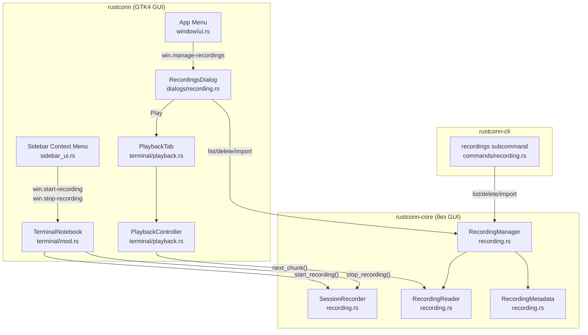
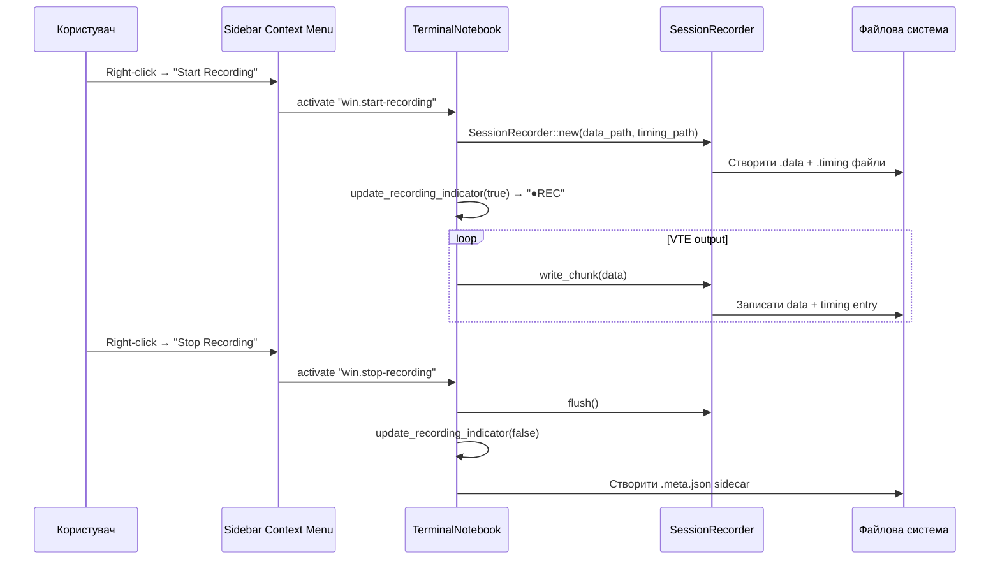
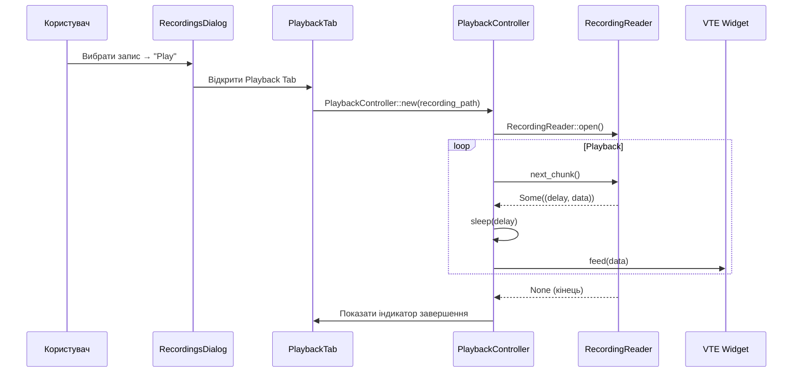

# Технічний дизайн: Session Recording Manager

## Огляд

Цей документ описує технічний дизайн повноцінного менеджера записів сесій для RustConn. Функціональність розширює існуючу інфраструктуру запису (`SessionRecorder`, `RecordingReader`, `start_recording()`/`stop_recording()`) до повного циклу: запис → керування → відтворення.

Дизайн слідує архітектурним принципам проєкту:
- **3-крейтовий workspace**: `rustconn-core` (бізнес-логіка, без GUI), `rustconn` (GTK4 GUI), `rustconn-cli` (CLI)
- **Правило розподілу**: "Чи потрібен GTK?" → Ні → `rustconn-core` / Так → `rustconn`
- **Існуючі патерни**: Manager pattern, CRUD діалоги (ClusterListDialog, TemplateManagerDialog), sidebar context menu через Popover + flat buttons, window actions

### Ключові рішення

1. **Метадані** — JSON sidecar файли (`.meta.json`) поруч з data/timing файлами
2. **Playback** — виділена вкладка Local Shell з VTE widget, overlay CSS та панеллю керування
3. **Вибір запису** — quick search filter (не dropdown) у панелі керування playback
4. **Timing** — запис з таймінгом між chunks, відтворення з дотриманням затримок
5. **CLI** — підкоманди `recordings list/delete/import` за патерном існуючих CLI команд

---

## Архітектура

### Діаграма компонентів



### Діаграма потоку запису



### Діаграма потоку відтворення



---

## Компоненти та інтерфейси

### 1. RecordingMetadata (rustconn-core/src/session/recording.rs)

Структура метаданих запису, що зберігається у JSON sidecar файлі.

```rust
/// Metadata for a recorded session, stored as a JSON sidecar file.
#[derive(Debug, Clone, PartialEq, Serialize, Deserialize)]
pub struct RecordingMetadata {
    /// Original connection name at the time of recording
    pub connection_name: String,
    /// User-defined display name (editable)
    #[serde(default, skip_serializing_if = "Option::is_none")]
    pub display_name: Option<String>,
    /// UTC timestamp when recording started
    pub created_at: chrono::DateTime<chrono::Utc>,
    /// Recording duration in seconds
    pub duration_secs: f64,
    /// Combined size of data + timing files in bytes
    pub total_size_bytes: u64,
}
```

Функції для роботи з метаданими:

```rust
/// Derives the .meta.json path from a data file path.
pub fn metadata_path(data_path: &Path) -> PathBuf {
    let stem = data_path.file_stem().unwrap_or_default().to_string_lossy();
    data_path.with_file_name(format!("{stem}.meta.json"))
}

/// Reads metadata from a JSON sidecar file.
pub fn read_metadata(meta_path: &Path) -> io::Result<RecordingMetadata> {
    let content = fs::read_to_string(meta_path)?;
    serde_json::from_str(&content)
        .map_err(|e| io::Error::new(io::ErrorKind::InvalidData, e))
}

/// Writes metadata to a JSON sidecar file.
pub fn write_metadata(meta_path: &Path, meta: &RecordingMetadata) -> io::Result<()> {
    let json = serde_json::to_string_pretty(meta)
        .map_err(|e| io::Error::new(io::ErrorKind::Other, e))?;
    fs::write(meta_path, json)
}

/// Derives metadata from filename and filesystem when no sidecar exists.
pub fn derive_metadata(data_path: &Path, timing_path: &Path) -> io::Result<RecordingMetadata> {
    // Parse connection_name and timestamp from filename pattern
    // Read file sizes and modification time from filesystem
}
```

### 2. RecordingManager (rustconn-core/src/session/recording.rs)

Менеджер для CRUD операцій над записами. Без GUI залежностей.

```rust
/// Manages recording files on disk (list, delete, import, rename).
pub struct RecordingManager {
    recordings_dir: PathBuf,
}

/// A recording entry with resolved file paths and metadata.
#[derive(Debug, Clone)]
pub struct RecordingEntry {
    pub data_path: PathBuf,
    pub timing_path: PathBuf,
    pub meta_path: PathBuf,
    pub metadata: RecordingMetadata,
}

impl RecordingManager {
    pub fn new(recordings_dir: PathBuf) -> Self;
    
    /// Lists all recordings, sorted by creation date (newest first).
    pub fn list(&self) -> io::Result<Vec<RecordingEntry>>;
    
    /// Deletes a recording (data + timing + meta files).
    pub fn delete(&self, data_path: &Path) -> io::Result<()>;
    
    /// Renames a recording by updating the display_name in metadata.
    pub fn rename(&self, data_path: &Path, new_name: &str) -> io::Result<()>;
    
    /// Imports an external scriptreplay file pair.
    /// Validates timing, copies files, generates metadata sidecar.
    /// Appends numeric suffix if names conflict.
    pub fn import(
        &self,
        source_data: &Path,
        source_timing: &Path,
    ) -> io::Result<RecordingEntry>;
    
    /// Validates a timing file: well-formed entries, byte sum <= data file size.
    pub fn validate_timing(
        data_path: &Path,
        timing_path: &Path,
    ) -> io::Result<()>;
}
```

**Алгоритм `list()`:**
1. Сканувати `recordings_dir` для файлів `*.data`
2. Для кожного `.data` файлу знайти відповідний `.timing` файл
3. Спробувати прочитати `.meta.json` sidecar; якщо відсутній — `derive_metadata()`
4. Сортувати за `created_at` (найновіші першими)

**Алгоритм `import()`:**
1. Викликати `validate_timing(source_data, source_timing)`
2. Визначити ім'я файлу: `imported_{original_stem}_{timestamp}`
3. Якщо конфлікт імен — додати числовий суфікс `_1`, `_2`, ...
4. Скопіювати data + timing файли у `recordings_dir`
5. Згенерувати `.meta.json` з `derive_metadata()`
6. Повернути `RecordingEntry`

**Алгоритм `validate_timing()`:**
1. Прочитати timing файл рядок за рядком
2. Кожен рядок: розпарсити `{f64} {usize}` — помилка якщо формат невірний
3. Підсумувати всі byte_count
4. Перевірити: сума <= розмір data файлу

### 3. Sidebar Context Menu (rustconn/src/sidebar_ui.rs)

Розширення існуючого `show_context_menu_for_item()`. Додати кнопки запису після існуючих кнопок для підключених сесій:

```rust
// Всередині show_context_menu_for_item(), після існуючих кнопок:
if is_connected {
    if is_recording {
        let stop_btn = create_menu_button(&i18n("Stop Recording"));
        stop_btn.add_css_class("destructive-action");
        stop_btn.set_tooltip_text(Some(&i18n("Stop recording this session")));
        // При натисканні: window.activate_action("stop-recording", None)
        menu_box.append(&stop_btn);
    } else {
        let start_btn = create_menu_button(&i18n("Start Recording"));
        start_btn.set_tooltip_text(Some(&i18n("Start recording this session")));
        // При натисканні: window.activate_action("start-recording", None)
        menu_box.append(&start_btn);
    }
}
```

Потрібно передати `is_recording: bool` параметр у `show_context_menu_for_item()` або визначити стан через `TerminalNotebook::is_recording(session_id)`.

### 4. RecordingsDialog (rustconn/src/dialogs/recording.rs)

CRUD діалог за патерном `ClusterListDialog` / `TemplateManagerDialog`:

```rust
pub struct RecordingsDialog {
    window: adw::Window,
    recordings_list: ListBox,
    recording_rows: Rc<RefCell<Vec<RecordingListRow>>>,
    on_play: Rc<RefCell<Option<Box<dyn Fn(RecordingEntry)>>>>,
    on_delete: Rc<RefCell<Option<Box<dyn Fn(PathBuf)>>>>,
    on_rename: Rc<RefCell<Option<Box<dyn Fn(PathBuf, String)>>>>,
    on_import: Rc<RefCell<Option<Box<dyn Fn()>>>>,
}

struct RecordingListRow {
    row: ListBoxRow,
    data_path: PathBuf,
    name_label: Label,
    date_label: Label,
    duration_label: Label,
    size_label: Label,
    play_button: Button,
    rename_button: Button,
    delete_button: Button,
}

impl RecordingsDialog {
    pub fn new(parent: Option<&gtk4::Window>) -> Self;
    pub fn refresh_list(&self);
    pub fn present(&self);
    pub fn set_on_play<F: Fn(RecordingEntry) + 'static>(&self, cb: F);
    pub fn set_on_delete<F: Fn(PathBuf) + 'static>(&self, cb: F);
    pub fn set_on_rename<F: Fn(PathBuf, String) + 'static>(&self, cb: F);
    pub fn set_on_import<F: Fn() + 'static>(&self, cb: F);
}
```

**Структура UI:**
- `adw::Window` (modal, 600x450)
- Header bar з кнопкою "Import" (icon: document-open-symbolic)
- `ListBox` з рядками записів
- Кожен рядок: назва, дата, тривалість, розмір + кнопки Play/Rename/Delete
- Placeholder при порожньому списку: `adw::StatusPage` з іконкою та текстом

**Accessible labels:**
- Кожна кнопка має `set_tooltip_text()` та accessible label
- ListBox підтримує keyboard navigation (вбудовано у GTK4)

### 5. PlaybackTab та PlaybackController (rustconn/src/terminal/playback.rs)

```rust
/// Controls playback of a recorded session with timing delays.
pub struct PlaybackController {
    reader: Option<RecordingReader>,
    state: PlaybackState,
    cancel_handle: Rc<Cell<Option<glib::SourceId>>>,
    current_data_path: Option<PathBuf>,
    current_timing_path: Option<PathBuf>,
}

#[derive(Debug, Clone, Copy, PartialEq, Eq)]
pub enum PlaybackState {
    Idle,
    Playing,
    Stopped,
    Completed,
}

impl PlaybackController {
    pub fn new() -> Self;
    
    /// Loads a recording for playback.
    pub fn load(&mut self, data_path: &Path, timing_path: &Path) -> io::Result<()>;
    
    /// Starts or resumes playback, feeding chunks to VTE with timing delays.
    /// Uses glib::timeout_add_local for non-blocking delay scheduling.
    pub fn play(&mut self, vte: &vte4::Terminal);
    
    /// Stops playback at current position.
    pub fn stop(&mut self);
    
    /// Resets to beginning and starts playing.
    pub fn repeat(&mut self, vte: &vte4::Terminal);
    
    /// Returns current playback state.
    pub fn state(&self) -> PlaybackState;
}
```

**Механізм відтворення з таймінгом:**
- `play()` зчитує наступний chunk через `RecordingReader::next_chunk()`
- Отримує `(delay, data)` — затримку та байти
- Використовує `glib::timeout_add_local_once(delay, ...)` для планування наступного chunk
- Callback: `vte.feed(&data)` → планує наступний chunk
- Ланцюжок продовжується до `None` (кінець запису)
- `stop()` скасовує поточний `glib::SourceId`

**Панель керування Playback Tab:**

```rust
/// Creates the playback control toolbar with quick search filter.
fn create_playback_toolbar(
    recordings: &[RecordingEntry],
) -> PlaybackToolbar {
    // toolbar_box: горизонтальний GtkBox
    // clear_btn: "Clear" (edit-clear-symbolic)
    // play_btn: "Play" (media-playback-start-symbolic)
    // stop_btn: "Stop" (media-playback-stop-symbolic)
    // repeat_btn: "Repeat" (media-playlist-repeat-symbolic)
    // search_entry: SearchEntry для quick search filter
    // filtered_list: Popover з ListBox, фільтрований через search_entry
}
```

**CSS клас для візуального виділення:**
```css
.playback-tab {
    background-color: alpha(@accent_bg_color, 0.08);
    border-top: 2px solid @accent_color;
}
```

### 6. Генерація метаданих при зупинці запису

Розширити `TerminalNotebook::stop_recording()` для створення `.meta.json` sidecar:

```rust
pub fn stop_recording(&self, session_id: Uuid) {
    if let Some(recorder) = self.session_recorders.borrow_mut().remove(&session_id) {
        let _ = recorder.borrow_mut().flush();
    }
    self.update_recording_indicator(session_id, false);
    
    // Generate .meta.json sidecar
    if let Some((data_path, timing_path, connection_name, start_time)) = 
        self.recording_paths.borrow_mut().remove(&session_id) 
    {
        let duration = start_time.elapsed().as_secs_f64();
        let data_size = std::fs::metadata(&data_path).map(|m| m.len()).unwrap_or(0);
        let timing_size = std::fs::metadata(&timing_path).map(|m| m.len()).unwrap_or(0);
        
        let meta = RecordingMetadata {
            connection_name,
            display_name: None,
            created_at: chrono::Utc::now(),
            duration_secs: duration,
            total_size_bytes: data_size + timing_size,
        };
        let meta_path = metadata_path(&data_path);
        let _ = write_metadata(&meta_path, &meta);
    }
}
```

Нове поле у `TerminalNotebook` для зберігання шляхів та часу старту:

```rust
// HashMap<Uuid, (data_path, timing_path, connection_name, start_time)>
recording_paths: RefCell<HashMap<Uuid, (PathBuf, PathBuf, String, Instant)>>,
```

### 7. CLI recordings subcommand (rustconn-cli/src/commands/recording.rs)

```rust
pub fn cmd_recording(subcmd: RecordingCommands) -> Result<(), CliError> {
    match subcmd {
        RecordingCommands::List { format } => cmd_recording_list(format),
        RecordingCommands::Delete { name, force } => cmd_recording_delete(&name, force),
        RecordingCommands::Import { data_file, timing_file } => {
            cmd_recording_import(&data_file, &timing_file)
        }
    }
}
```

CLI enum у `cli.rs`:

```rust
/// Manage session recordings
#[derive(Subcommand)]
pub enum RecordingCommands {
    /// List all recordings with metadata
    List {
        #[arg(long, default_value = "table")]
        format: OutputFormat,
    },
    /// Delete a recording by name
    Delete {
        name: String,
        /// Skip confirmation prompt
        #[arg(long)]
        force: bool,
    },
    /// Import external scriptreplay files
    Import {
        /// Path to the data file
        data_file: PathBuf,
        /// Path to the timing file
        timing_file: PathBuf,
    },
}
```

### 8. App Menu (rustconn/src/window/ui.rs)

Додати у Tools section після існуючих пунктів:

```rust
tools_section.append(Some(&i18n("Recordings...")), Some("win.manage-recordings"));
```

### 9. Обробка граничних випадків

**Disconnect під час запису:**
У обробнику disconnect (вже існує у `TerminalNotebook`) — викликати `stop_recording(session_id)`.

**Disk full:**
`SessionRecorder::write_chunk()` вже повертає `io::Result`. При помилці запису — логувати через `tracing::warn!`, зупинити запис, показати notification.

**Duplicate start:**
`TerminalNotebook::start_recording()` — перевірити `is_recording(session_id)` на початку, повернути `true` без дій якщо вже записується.

**Shutdown:**
У обробнику закриття вікна — ітерувати `session_recorders` та викликати `flush()` для кожного.

**Видалена директорія:**
`write_chunk()` повертає `io::Error` — обробляється як disk full.

---

## Моделі даних

### RecordingMetadata JSON формат

```json
{
    "connection_name": "prod-server-01",
    "display_name": "Деплой v2.5.0",
    "created_at": "2025-01-15T14:30:00Z",
    "duration_secs": 342.5,
    "total_size_bytes": 15234
}
```

### Файлова структура записів

```
$XDG_DATA_HOME/rustconn/recordings/
├── prod-server-01_20250115_143000.data
├── prod-server-01_20250115_143000.timing
├── prod-server-01_20250115_143000.meta.json
├── dev-box_20250116_091500.data
├── dev-box_20250116_091500.timing
└── dev-box_20250116_091500.meta.json
```

### Timing file формат (scriptreplay-compatible)

```
0.000000 45
0.123456 128
0.050000 67
1.234567 256
```

Кожен рядок: `{delay_seconds} {byte_count}\n`
- `delay_seconds` — затримка від попереднього chunk (f64)
- `byte_count` — кількість байтів у цьому chunk (usize)

### Зв'язок з існуючою моделлю Connection

Поле `Connection::session_recording_enabled: bool` (вже існує) використовується для автоматичного запису при підключенні. Діалог з'єднання вже має toggle у Advanced tab.

### Зміни у існуючих структурах

Жодних змін у існуючих моделях не потрібно. `RecordingMetadata`, `RecordingManager`, `RecordingEntry` — нові структури у `recording.rs`.

---

## Correctness Properties

*Властивість коректності (correctness property) — це характеристика або поведінка, яка повинна бути істинною для всіх допустимих виконань системи. Властивості слугують мостом між людино-читабельними специфікаціями та машинно-верифікованими гарантіями коректності.*

### Property 1: Recording round-trip

*For any* sequence of non-empty byte chunks, writing them through `SessionRecorder` and then reading them back through `RecordingReader` shall produce the same number of chunks with byte-identical concatenated data. Empty chunks in the input shall be skipped (not produce timing entries).

**Validates: Requirements 3.5, 3.6, 3.1**

### Property 2: Filename sanitization preserves structure

*For any* connection name string, `recording_paths()` shall produce file paths where the filename contains only alphanumeric characters, hyphens, underscores, and dots, followed by a UTC timestamp suffix, and ends with `.data` / `.timing` extensions respectively.

**Validates: Requirements 3.3**

### Property 3: Sanitization redacts sensitive data

*For any* byte chunk containing a known sensitive pattern (e.g., "password:", "Password:"), writing it through `SessionRecorder` with sanitization enabled and reading it back shall produce output that contains `[REDACTED]` instead of the original sensitive content.

**Validates: Requirements 3.4**

### Property 4: Metadata serde round-trip

*For any* valid `RecordingMetadata` structure, serializing it to JSON via `write_metadata()` and then deserializing via `read_metadata()` shall produce an equivalent `RecordingMetadata` structure.

**Validates: Requirements 5.5, 5.3, 5.4, 5.1**

### Property 5: Derive metadata from filename

*For any* recording file pair with a filename matching the pattern `{name}_{YYYYMMDD_HHMMSS}.data`, `derive_metadata()` shall produce a `RecordingMetadata` where `connection_name` equals the extracted name portion and `total_size_bytes` equals the sum of both file sizes.

**Validates: Requirements 5.6**

### Property 6: Rename persists display name

*For any* existing recording and any non-empty display name string, calling `RecordingManager::rename()` and then reading the metadata back shall produce a `RecordingMetadata` where `display_name` equals the provided name.

**Validates: Requirements 4.3**

### Property 7: Delete removes all recording files

*For any* existing recording (data + timing + meta files), calling `RecordingManager::delete()` shall result in none of the three files existing on disk.

**Validates: Requirements 4.4**

### Property 8: Recording indicator round-trip

*For any* tab title string that does not already contain the "●REC" prefix, adding the recording indicator and then removing it shall produce the original tab title string.

**Validates: Requirements 7.1, 7.2, 7.3**

### Property 9: Duplicate start recording is idempotent

*For any* session that is already being recorded, calling `start_recording()` again shall not create a second recorder and shall return `true` (success), leaving the existing recording unchanged.

**Validates: Requirements 8.3**

### Property 10: Timing file validation

*For any* timing file with well-formed entries (each line is `{f64} {usize}`), `validate_timing()` shall return `Ok(())` if and only if the sum of all byte counts does not exceed the data file size. For any timing file with malformed entries (non-numeric values, missing fields), `validate_timing()` shall return an error.

**Validates: Requirements 9.2, 9.3**

### Property 11: Import produces complete recording without overwriting

*For any* valid external scriptreplay file pair, `RecordingManager::import()` shall create exactly three files (data, timing, meta.json) in the recordings directory. If a file with the same name already exists, the imported files shall have a different name and the original files shall remain unchanged.

**Validates: Requirements 9.4, 9.5**

### Property 12: CLI list output contains all metadata fields

*For any* non-empty list of `RecordingEntry` items, the formatted table output shall contain the connection name (or display name), creation date, duration, and file size for each entry.

**Validates: Requirements 11.1**

---

## Обробка помилок

### Помилки запису (SessionRecorder)

| Ситуація | Обробка |
|----------|---------|
| Директорія записів недоступна | `start_recording()` повертає `false`, notification користувачу |
| Disk full під час запису | `write_chunk()` повертає `Err`, зупинити запис, flush буферів, notification |
| Директорія видалена під час запису | `write_chunk()` повертає `Err`, аналогічно disk full |
| Дублікат start_recording | Ігнорувати, повернути `true` |

### Помилки імпорту (RecordingManager)

| Ситуація | Обробка |
|----------|---------|
| Невалідний timing файл | `validate_timing()` повертає `Err` з описом помилки |
| Сума байтів > розмір data | `validate_timing()` повертає `Err("byte count sum exceeds data file size")` |
| Конфлікт імен файлів | Додати числовий суфікс `_1`, `_2`, ... |
| Файл не знайдено | `io::Error(NotFound)` |

### Помилки метаданих

| Ситуація | Обробка |
|----------|---------|
| Відсутній .meta.json | `derive_metadata()` з filename + filesystem |
| Невалідний JSON у .meta.json | `read_metadata()` повертає `Err`, fallback на `derive_metadata()` |
| Помилка запису .meta.json | Логувати warning, запис все одно збережено |

### Помилки відтворення (PlaybackController)

| Ситуація | Обробка |
|----------|---------|
| Файл запису не знайдено | `load()` повертає `Err`, показати повідомлення |
| Пошкоджений timing файл | `RecordingReader::open()` повертає `Err` |
| Playback вже активний | `play()` ігнорує якщо стан Playing |

### Помилки CLI

| Ситуація | Обробка |
|----------|---------|
| Запис не знайдено | `CliError` з описом, exit code 1 |
| Невалідні файли для імпорту | `CliError` з описом валідації, exit code 1 |
| Директорія записів недоступна | `CliError` з описом, exit code 1 |

---

## Стратегія тестування

### Бібліотека property-based тестування

**Бібліотека:** `proptest` (вже використовується у проєкті як dev-dependency)

### Конфігурація

- Мінімум **100 ітерацій** на кожен property test (`ProptestConfig::with_cases(100)`)
- Кожен тест має коментар-тег: `// Feature: session-recording-manager, Property N: ...`

### Файл тестів

**Файл:** `rustconn-core/tests/properties/recording_tests.rs` (розширити існуючий)

### Property-based тести

Кожна correctness property реалізується одним property-based тестом:

1. **Property 1: Recording round-trip** — генерувати `Vec<Vec<u8>>` (включаючи порожні chunks), записати через `SessionRecorder`, прочитати через `RecordingReader`, порівняти
   - Tag: `// Feature: session-recording-manager, Property 1: Recording round-trip`

2. **Property 2: Filename sanitization** — генерувати довільні рядки, перевірити що `recording_paths()` повертає шляхи з валідними символами
   - Tag: `// Feature: session-recording-manager, Property 2: Filename sanitization preserves structure`

3. **Property 3: Sanitization redaction** — генерувати рядки з "password:" prefix, перевірити що вивід містить `[REDACTED]`
   - Tag: `// Feature: session-recording-manager, Property 3: Sanitization redacts sensitive data`

4. **Property 4: Metadata serde round-trip** — генерувати довільні `RecordingMetadata`, serialize → deserialize → порівняти
   - Tag: `// Feature: session-recording-manager, Property 4: Metadata serde round-trip`

5. **Property 5: Derive metadata** — створити файли з валідними іменами, перевірити `derive_metadata()` повертає правильні поля
   - Tag: `// Feature: session-recording-manager, Property 5: Derive metadata from filename`

6. **Property 6: Rename persists** — створити запис, rename, прочитати metadata, перевірити display_name
   - Tag: `// Feature: session-recording-manager, Property 6: Rename persists display name`

7. **Property 7: Delete removes all** — створити запис (3 файли), delete, перевірити що жоден не існує
   - Tag: `// Feature: session-recording-manager, Property 7: Delete removes all recording files`

8. **Property 8: Indicator round-trip** — генерувати довільні tab titles, add indicator → remove indicator → порівняти з оригіналом
   - Tag: `// Feature: session-recording-manager, Property 8: Recording indicator round-trip`

9. **Property 9: Duplicate start idempotent** — unit test, бо потребує TerminalNotebook (GUI); перевірити що `is_recording()` повертає true і повторний виклик не змінює стан
   - Tag: `// Feature: session-recording-manager, Property 9: Duplicate start is idempotent`

10. **Property 10: Timing validation** — генерувати валідні та невалідні timing файли, перевірити результат `validate_timing()`
    - Tag: `// Feature: session-recording-manager, Property 10: Timing file validation`

11. **Property 11: Import complete** — створити валідну пару файлів, import, перевірити 3 файли існують; повторити з конфліктом імен
    - Tag: `// Feature: session-recording-manager, Property 11: Import produces complete recording`

12. **Property 12: CLI list output** — генерувати список `RecordingEntry`, форматувати, перевірити наявність всіх полів
    - Tag: `// Feature: session-recording-manager, Property 12: CLI list contains metadata`

### Unit тести

Доповнюють property тести для конкретних прикладів та edge cases:

- **Empty recordings directory** — `RecordingManager::list()` повертає порожній вектор
- **Metadata fallback** — запис без `.meta.json` → `derive_metadata()` працює
- **Import with conflicting names** — конкретний приклад з суфіксом `_1`
- **Timing validation edge cases** — порожній timing файл, від'ємні значення, нульовий byte count
- **Sanitization of non-UTF-8 data** — бінарні дані проходять без змін
- **Recording indicator with existing prefix** — title що вже містить "●REC" не дублюється

### Розподіл тестів по крейтах

| Крейт | Тести |
|-------|-------|
| `rustconn-core` | Properties 1-7, 10-12 + unit тести для RecordingManager, RecordingMetadata, validate_timing |
| `rustconn` | Property 8 (indicator), Property 9 (duplicate start) + integration тести для PlaybackController |
| `rustconn-cli` | Unit тести для CLI output formatting |
