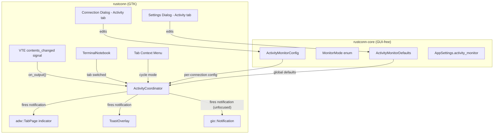

# Design Document: Terminal Activity Monitor

## Overview

Terminal Activity Monitor adds per-session activity and silence detection to RustConn terminal tabs, inspired by KDE Konsole. Each SSH terminal session can independently track output events and notify the user when:

- **Activity mode**: New terminal output appears after a configurable quiet period (default 10s)
- **Silence mode**: No terminal output occurs for a configurable duration (default 30s)

Notifications are delivered through four channels: tab indicator icons, CSS pulse animations, in-app toasts, and desktop notifications (when the window is unfocused).

The feature follows existing RustConn patterns: data models in `rustconn-core`, GTK widgets in `rustconn`, `MonitoringCoordinator`-style per-session lifecycle, `Rc<RefCell<>>` state management, and `i18n()` for all user-facing strings.

## Architecture



The architecture separates concerns:
- **rustconn-core**: Pure data models (`MonitorMode`, `ActivityMonitorConfig`, `ActivityMonitorDefaults`) with serde support, validation, and config resolution logic. No GTK dependencies.
- **rustconn**: `ActivityCoordinator` owns per-session `glib::timeout_add_local` timers, listens to VTE signals, manages notification delivery, and integrates with the tab UI.

## Components and Interfaces

### 1. MonitorMode enum (rustconn-core)

Serializable three-state enum stored in both per-connection config and global defaults.

```rust
#[derive(Debug, Clone, Copy, PartialEq, Eq, Serialize, Deserialize, Default)]
pub enum MonitorMode {
    #[default]
    Off,
    Activity,
    Silence,
}

impl MonitorMode {
    /// Cycles: Off → Activity → Silence → Off
    pub const fn next(self) -> Self;
    pub const fn icon_name(self) -> &'static str;
    pub const fn display_name(self) -> &'static str;
}
```

### 2. ActivityMonitorConfig (rustconn-core)

Per-connection override stored on `Connection` as `Option<ActivityMonitorConfig>`. Follows the same `Option<T>` override pattern as existing `MonitoringConfig`.

```rust
#[derive(Debug, Clone, PartialEq, Eq, Serialize, Deserialize)]
pub struct ActivityMonitorConfig {
    pub mode: Option<MonitorMode>,
    pub quiet_period_secs: Option<u32>,
    pub silence_timeout_secs: Option<u32>,
}

impl ActivityMonitorConfig {
    pub fn effective_mode(&self, global: &ActivityMonitorDefaults) -> MonitorMode;
    pub fn effective_quiet_period(&self, global: &ActivityMonitorDefaults) -> u32;
    pub fn effective_silence_timeout(&self, global: &ActivityMonitorDefaults) -> u32;
}
```

### 3. ActivityMonitorDefaults (rustconn-core)

Global defaults stored in `AppSettings.activity_monitor`.

```rust
#[derive(Debug, Clone, PartialEq, Eq, Serialize, Deserialize)]
pub struct ActivityMonitorDefaults {
    pub mode: MonitorMode,           // default: Off
    pub quiet_period_secs: u32,      // 1–300, default: 10
    pub silence_timeout_secs: u32,   // 1–600, default: 30
}
```

Clamping methods ensure values stay within valid ranges regardless of what's stored in config files.

### 4. ActivityCoordinator (rustconn)

Per-session state manager following the `MonitoringCoordinator` pattern. Owns timers and notification state.

```rust
pub struct ActivityCoordinator {
    sessions: RefCell<HashMap<Uuid, SessionActivityState>>,
}

struct SessionActivityState {
    mode: MonitorMode,
    quiet_period_secs: u32,
    silence_timeout_secs: u32,
    last_output_time: Instant,
    notification_active: bool,
    silence_timer_id: Option<glib::SourceId>,
}

impl ActivityCoordinator {
    pub fn new() -> Self;
    pub fn start(&self, session_id: Uuid, mode: MonitorMode, quiet: u32, silence: u32);
    pub fn stop(&self, session_id: Uuid);
    pub fn stop_all(&self);
    /// Called on VTE contents_changed. Returns Some(notification_type) if should notify.
    pub fn on_output(&self, session_id: Uuid) -> Option<NotificationType>;
    /// Called when user switches to this tab. Clears notification state.
    pub fn on_tab_switched(&self, session_id: Uuid);
    /// Cycles mode for context menu toggle.
    pub fn cycle_mode(&self, session_id: Uuid) -> MonitorMode;
    pub fn set_mode(&self, session_id: Uuid, mode: MonitorMode);
    pub fn get_mode(&self, session_id: Uuid) -> Option<MonitorMode>;
}
```

**State machine logic:**

- **Activity mode**: On each `on_output()`, check if `Instant::now() - last_output_time >= quiet_period`. If yes, fire activity notification. Always update `last_output_time`.
- **Silence mode**: On each `on_output()`, reset the silence timer. The timer callback fires a silence notification when it expires without being reset.
- **Off mode**: `on_output()` is a no-op, returns `None`.

### 5. Notification Delivery

When `ActivityCoordinator` determines a notification should fire:

1. **Tab indicator**: `tab_page.set_indicator_icon(Some(&gio::ThemedIcon::new(icon_name)))` — uses `"dialog-information-symbolic"` for activity, `"dialog-warning-symbolic"` for silence.
2. **Toast**: Existing `ToastOverlay` with `ToastType::Info` for activity, `ToastType::Warning` for silence. Message uses `i18n_f("Activity detected: {}", &[&session_name])`.
3. **Desktop notification**: `gio::Notification::new(&title)` sent via `app.send_notification()` only when `!window.is_active()`.
4. **Clear on tab switch**: `on_tab_switched()` clears indicator icon via `tab_page.set_indicator_icon(gio::ThemedIcon::NONE)` and resets `notification_active`.

### 6. UI Integration Points

- **Connection Dialog**: New "Activity Monitor" `adw::PreferencesGroup` in the advanced tab with `adw::ComboRow` for mode, `adw::SpinRow` for quiet period, `adw::SpinRow` for silence timeout.
- **Settings Dialog**: New "Activity Monitor" `adw::PreferencesGroup` (can be added to the existing Monitoring tab or a new tab) with default mode, quiet period, silence timeout.
- **Tab Context Menu**: Add "Monitor: Off/Activity/Silence" action group with `gio::SimpleAction` for cycling mode.

## Data Models

### New types in rustconn-core

| Type | Location | Purpose |
|------|----------|---------|
| `MonitorMode` | `rustconn-core/src/activity_monitor.rs` | Three-state enum (Off/Activity/Silence) |
| `ActivityMonitorConfig` | `rustconn-core/src/activity_monitor.rs` | Per-connection override with Option fields |
| `ActivityMonitorDefaults` | `rustconn-core/src/activity_monitor.rs` | Global defaults with clamping |

### Modified types

| Type | Change |
|------|--------|
| `Connection` | Add `pub activity_monitor_config: Option<ActivityMonitorConfig>` field |
| `AppSettings` | Add `pub activity_monitor: ActivityMonitorDefaults` field |

### Serialization

All new types derive `Serialize`/`Deserialize`. The `Connection` field uses `#[serde(default, skip_serializing_if = "Option::is_none")]` for backward compatibility. `AppSettings` field uses `#[serde(default)]`.

### NotificationType (rustconn only)

```rust
pub enum NotificationType {
    Activity,
    Silence,
}
```

## Correctness Properties

*A property is a characteristic or behavior that should hold true across all valid executions of a system — essentially, a formal statement about what the system should do. Properties serve as the bridge between human-readable specifications and machine-verifiable correctness guarantees.*

### Property 1: Activity notification fires after quiet period

*For any* `ActivityMonitorState` with mode=Activity, quiet_period Q (1–300), last_output_time T₀, and new output event at time T₁, the system SHALL fire an activity notification if and only if (T₁ - T₀) >= Q seconds.

**Validates: Requirements 1.1**

### Property 2: Silence notification fires after timeout

*For any* `ActivityMonitorState` with mode=Silence, silence_timeout S (1–600), and last_output_time T₀, the system SHALL fire a silence notification if and only if no output event occurs within S seconds of T₀.

**Validates: Requirements 1.2**

### Property 3: Off mode suppresses all notifications

*For any* `ActivityMonitorState` with mode=Off, and any sequence of output events at any timing, the system SHALL never fire a notification.

**Validates: Requirements 1.3**

### Property 4: Tab switch clears notification state

*For any* session with `notification_active = true`, calling `on_tab_switched()` SHALL result in `notification_active = false`.

**Validates: Requirements 1.7**

### Property 5: Mode cycling is a 3-cycle

*For any* `MonitorMode` value M, calling `next()` three times SHALL return M. The cycle is Off → Activity → Silence → Off.

**Validates: Requirements 1.10**

### Property 6: Serialization round-trip

*For any* valid `ActivityMonitorConfig` (with arbitrary `Option<MonitorMode>`, `Option<u32>`, `Option<u32>`), serializing to JSON and deserializing back SHALL produce an equal value.

**Validates: Requirements 1.11**

### Property 7: Config resolution prefers per-connection overrides

*For any* `ActivityMonitorDefaults` (global) and `ActivityMonitorConfig` (per-connection), the effective mode/quiet_period/silence_timeout SHALL equal the per-connection value when `Some`, and the global default when `None`.

**Validates: Requirements 1.8, 1.9, 1.18**

### Property 8: Timeout clamping

*For any* `u32` value V used as `quiet_period_secs`, the effective quiet period SHALL be `V.clamp(1, 300)`. *For any* `u32` value V used as `silence_timeout_secs`, the effective silence timeout SHALL be `V.clamp(1, 600)`.

**Validates: Requirements 1.15, 1.16**

## Error Handling

| Scenario | Handling |
|----------|----------|
| Invalid quiet_period/silence_timeout in config file | Clamp to valid range on deserialization via `effective_*` methods |
| Session not found in coordinator | Return `None` / no-op (session may have been closed) |
| Desktop notification fails (e.g., no notification daemon) | Log warning via `tracing::warn!`, continue without desktop notification |
| Timer source removed unexpectedly | Coordinator checks `silence_timer_id` validity before operations |
| VTE signal fires after session cleanup | `on_output()` returns `None` for unknown session IDs |

All error types use `thiserror::Error` per project conventions. No `unwrap()`/`expect()` calls.

## Testing Strategy

### Property-Based Tests (rustconn-core)

Location: `rustconn-core/tests/properties/activity_monitor_tests.rs`

Using `proptest` (already in the project's test dependencies). Each test runs minimum 100 iterations.

| Test | Property | Tag |
|------|----------|-----|
| Activity timing | Property 1 | `Feature: terminal-activity-monitor, Property 1: Activity notification fires after quiet period` |
| Silence timing | Property 2 | `Feature: terminal-activity-monitor, Property 2: Silence notification fires after timeout` |
| Off suppression | Property 3 | `Feature: terminal-activity-monitor, Property 3: Off mode suppresses all notifications` |
| Tab switch clears | Property 4 | `Feature: terminal-activity-monitor, Property 4: Tab switch clears notification state` |
| Mode cycling | Property 5 | `Feature: terminal-activity-monitor, Property 5: Mode cycling is a 3-cycle` |
| Serde round-trip | Property 6 | `Feature: terminal-activity-monitor, Property 6: Serialization round-trip` |
| Config resolution | Property 7 | `Feature: terminal-activity-monitor, Property 7: Config resolution prefers per-connection overrides` |
| Timeout clamping | Property 8 | `Feature: terminal-activity-monitor, Property 8: Timeout clamping` |

### Unit Tests (rustconn-core)

- Example: Activity notification with specific timing values
- Example: Silence notification with specific timing values
- Edge case: quiet_period = 0 clamps to 1
- Edge case: silence_timeout = 0 clamps to 1
- Example: Default `ActivityMonitorDefaults` values

### Integration Tests

- Connection with `activity_monitor_config` serializes/deserializes correctly within full `Connection` JSON
- `AppSettings` with `activity_monitor` field round-trips through TOML
