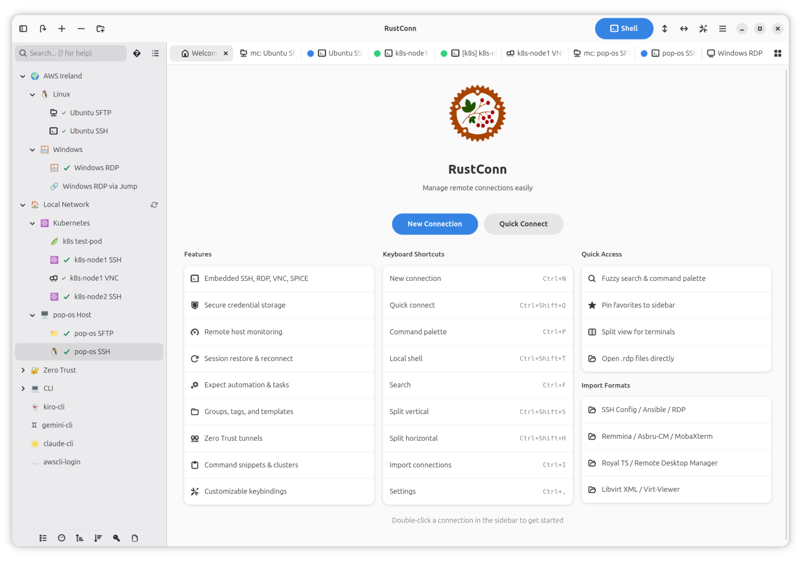
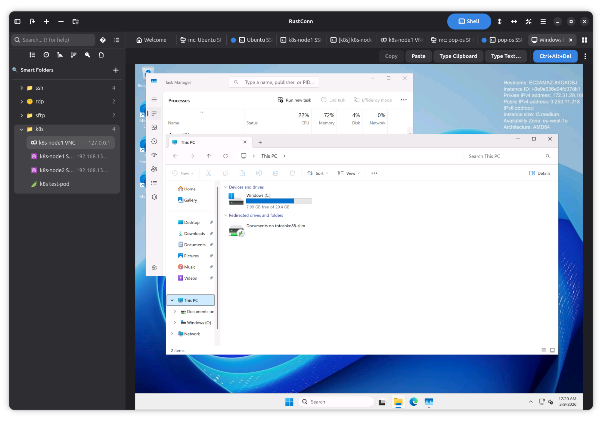
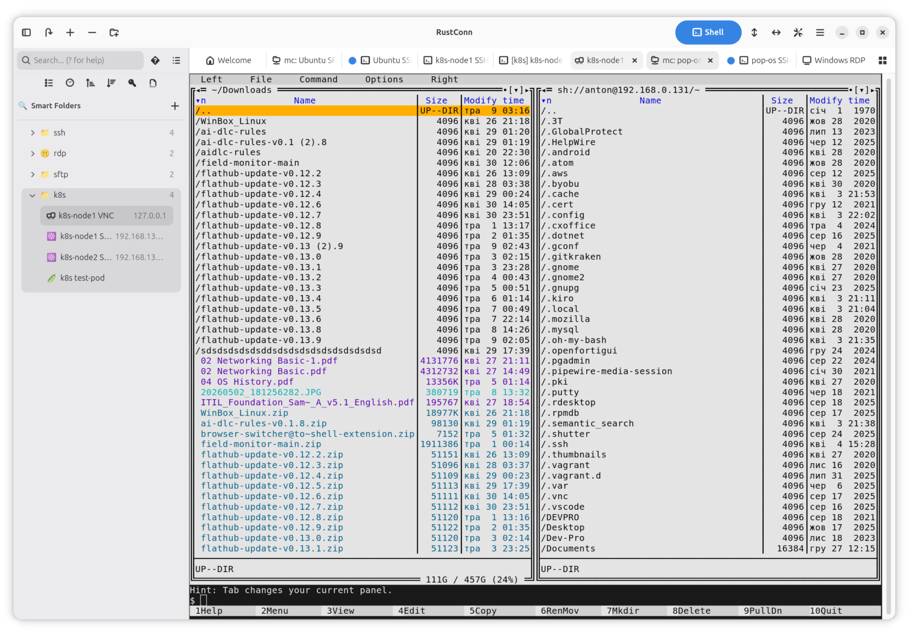

  

<h1 align="center">RustConn</h1>

  Modern connection manager — SSH, RDP, VNC, SPICE, and more

  
  
  
  
  
  
  

---

RustConn is a cross-platform connection orchestrator with a GTK4/libadwaita interface.
It brings SSH, RDP, VNC, SPICE, MOSH, Telnet, Serial, Kubernetes, and Zero Trust connections under one roof — with embedded Rust clients where possible and seamless integration with external tools where needed.
Runs on Linux (GTK4/libadwaita), macOS, FreeBSD, and Windows via WSLg.

## Screenshots

| | |
|---|---|
|  |  |
|  |  |

More screenshots on the [Flathub listing](https://flathub.org/apps/io.github.totoshko88.RustConn).

## Features

### Capabilities

| Category | Details |
|----------|---------|
| **File Transfer** | SFTP file browser via system file manager (sftp:// URI, D-Bus portal) |
| **Organization** | Groups, tags, templates, custom icons (emoji/GTK), connection history & statistics |
| **Monitoring** | Remote host metrics bar (CPU, RAM, disk, network, load, system info) — agentless, per-connection toggle |
| **Import/Export** | Asbru-CM, Remmina, SSH config, Ansible inventory, Royal TS, MobaXterm, SecureCRT, Remote Desktop Manager, RDP files (.rdp), virt-viewer (.vv), libvirt XML, CSV, native (.rcn) |
| **Security** | KeePassXC (KDBX), libsecret, Bitwarden CLI, 1Password CLI, Passbolt CLI, Pass (passwordstore.org), script credentials; hardware-token SSH auth (FIDO2 security keys, PKCS#11 / YubiKey / smart cards) |
| **Terminal** | Split terminals, command snippets, text highlighting rules, session recording, custom terminal themes, tab overview, tab pinning |
| **Automation** | Expect rules, key sequences, pre/post-connect tasks, cluster & ad-hoc broadcast, session reconnect, Wake-on-LAN |
| **Workflow** | Smart folders, SSH port forwarding, visual SSH tunnel builder, workspace profiles (save/restore open sessions), settings backup/restore, .rdp file association |
| **Cloud Sync** | Synchronize connections via shared cloud directory (Google Drive, Syncthing, Nextcloud, Dropbox); group sync with Master/Import access model; simple sync with UUID-based merge |
| **CLI** | `rustconn-cli` — headless management: list/add/update/delete connections, import/export, snippets, groups, templates, clusters, secrets, WoL, shell completions |
| **Languages** | English + 16 translations (Belarusian, Czech, Danish, German, Spanish, French, Italian, Kazakh, Dutch, Polish, Portuguese, Slovak, Swedish, Ukrainian, Uzbek, Chinese) |

### Protocol support

| Protocol | Client | Type |
|----------|--------|------|
| SSH | VTE terminal (port forwarding: -L/-R/-D) | Embedded |
| RDP | IronRDP / FreeRDP fallback (bundled in Flatpak) | Embedded + external |
| VNC | vnc-rs / vncviewer fallback | Embedded + external |
| SPICE | spice-client / remote-viewer fallback | Embedded + external |
| Telnet | VTE terminal | Embedded |
| Serial | picocom via VTE | External (bundled in Flatpak) |
| Kubernetes | kubectl exec via VTE | External |
| MOSH | mosh via VTE | External |
| Zero Trust | AWS SSM, GCP IAP, Azure, OCI, Cloudflare, Teleport, Tailscale, Boundary, Hoop.dev | External |
| Web | System browser (UriLauncher / xdg-open) | External |

## Installation

  <a href="https://flathub.org/apps/io.github.totoshko88.RustConn">
    <picture>
      <source media="(prefers-color-scheme: dark)" srcset="https://flathub.org/assets/badges/flathub-badge-i-en.svg">
      
    </picture>
  </a>
  &nbsp;
  <a href="https://snapcraft.io/rustconn">
    <picture>
      <source media="(prefers-color-scheme: dark)" srcset="https://snapcraft.io/en/light/install.svg">
      
    </picture>
  </a>

| Method | Command / Link |
|--------|---------------|
| **Flatpak** (recommended) | `flatpak install flathub io.github.totoshko88.RustConn` |
| **Snap** | `sudo snap install rustconn` ([permissions](docs/SNAP.md)) |
| **macOS (Homebrew)** | `brew tap totoshko88/rustconn && brew install rustconn` |
| **Debian 13 / Ubuntu 24.04 / Ubuntu 26.04** | OBS apt repository ([setup](docs/INSTALL.md#debian--ubuntu-obs-repository)) |
| **openSUSE** (Tumbleweed, Slowroll, Leap 16.0) | OBS zypper repository ([setup](docs/INSTALL.md#opensuse-obs)) |
| **Fedora 43 / 44** | OBS dnf repository ([setup](docs/INSTALL.md#fedora-obs)) |
| **Arch Linux** | `yay -S rustconn` ([AUR](https://aur.archlinux.org/packages/rustconn), community) |
| **FreeBSD** | `pkg install rustconn` ([ports](https://www.freshports.org/net/rustconn/), community) |
| **AppImage** | [GitHub Releases](https://github.com/totoshko88/RustConn/releases) |
| **Windows (WSL2)** | Runs under WSLg ([guide](docs/WSL.md)) |
| **From source** | Rust 1.95+, GTK4 4.14+ ([build guide](docs/BUILD.md)) |

Keyboard shortcuts are customizable in Settings → Keybindings; press `Ctrl+?`
in the app for the complete, always-current list.

## Documentation

| Document | Description |
|----------|-------------|
| [User Guide](docs/USER_GUIDE.md) | Complete usage documentation |
| [Installation](docs/INSTALL.md) | All installation methods and repository setup |
| [Build Guide](docs/BUILD.md) | Building from source, feature flags, per-distro prerequisites |
| [macOS Build](docs/MACOS_BUILD.md) | Building and running on macOS, Homebrew, DMG packaging |
| [Windows / WSL2](docs/WSL.md) | Running RustConn on Windows via WSLg |
| [CLI Reference](docs/CLI_REFERENCE.md) | `rustconn-cli` commands and examples |
| [Architecture](docs/ARCHITECTURE.md) | Crate structure and design decisions |
| [CI & Build Flow](docs/CI_BUILD_FLOW.md) | CI pipelines, OBS packaging, Flathub release process |
| [Zero Trust](docs/ZERO_TRUST.md) | Setup guides for each supported Zero Trust provider |
| [Changelog](CHANGELOG.md) | Release history and notable changes |

## Contributing

Bug reports and feature requests are welcome on the
[issue tracker](https://github.com/totoshko88/RustConn/issues).

- **Code** — see the [Build Guide](docs/BUILD.md) and
  [Architecture](docs/ARCHITECTURE.md) to get started.
- **Translations** — RustConn ships 16 languages; `.po` files live in
  [`po/`](po/). New languages and corrections are appreciated.

## Support

  
  
  

## License

GPL-3.0 — Made with ❤️ in Ukraine 🇺🇦
