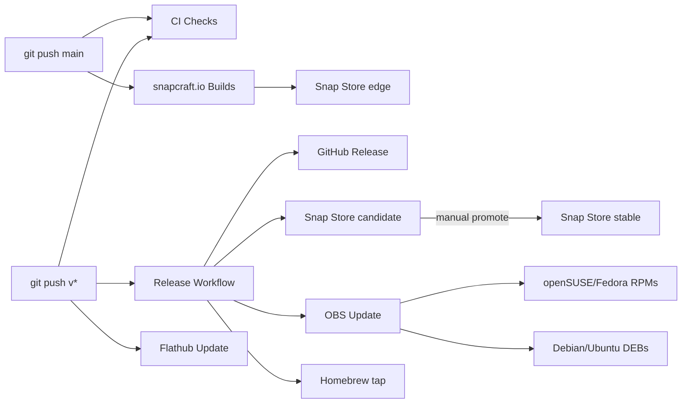
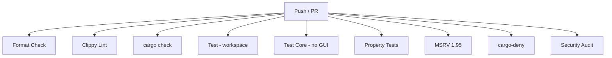
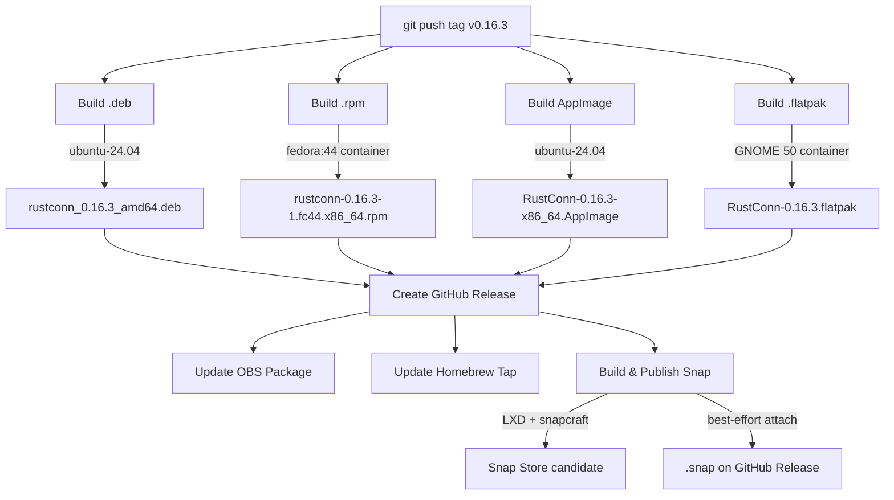
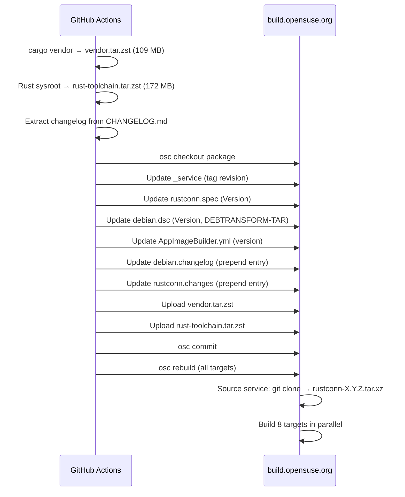
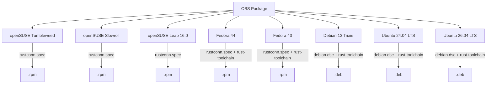
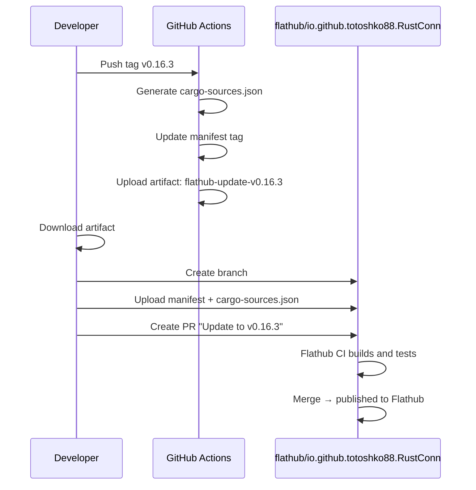

# CI & Build Flow

This document describes the complete CI/CD pipeline for RustConn, including
GitHub Actions workflows, OBS (Open Build Service) packaging, and Flathub releases.

## Overview

## CI Checks (`ci.yml`)

Runs on every push to `main`/`develop` and on pull requests.

| Job | What it does |
|-----|-------------|
| Format | `cargo fmt --all -- --check` |
| Clippy | `cargo clippy --all-targets -- -D warnings` |
| Check | `cargo check --all-targets` |
| Test | `cargo test --workspace` |
| Test Core | `cargo test -p rustconn-core --all-features` (no GUI deps) |
| Property Tests | `cargo test -p rustconn-core --test property_tests` (10 min timeout) |
| MSRV | `cargo check` with Rust 1.95 |
| cargo-deny | License + RustSec advisory checks (advisory ignore list in `deny.toml`) |

### Caching

Every cargo job caches `~/.cargo/registry`, `~/.cargo/git`, and `target/`
under a job-specific key (`-cargo-`, `-cargo-clippy-`, …), and all jobs share
a `restore-keys: <os>-cargo-` fallback. On a key miss (new `Cargo.lock`, new
job) the runner seeds from whichever sibling cache exists instead of
rebuilding the dependency graph from scratch.

## Release Workflow (`release.yml`)

Triggered by pushing a version tag (`v*`). This is the **single unified release workflow**
that builds all package formats, publishes to Snap Store, creates the GitHub Release,
and updates OBS.

> **Snap runs *after* the release** (like `update-obs` / `update-homebrew`).
> snapcraft + LXD are slow and occasionally flaky, so the GitHub Release must
> not be gated on it. The release is created from `.deb`/`.rpm`/`.AppImage`/`.flatpak`
> first; the `.snap` is then built, published to the store, and attached to the
> existing release on a best-effort basis.

### Build Jobs

| Job | Runner | Output |
|-----|--------|--------|
| `build-deb` | ubuntu-24.04 | `rustconn_X.Y.Z_amd64.deb` |
| `build-rpm` | fedora:44 container | `rustconn-X.Y.Z-1.fc44.x86_64.rpm` |
| `build-appimage` | ubuntu-24.04 + linuxdeploy | `RustConn-X.Y.Z-x86_64.AppImage` |
| `build-snap` | ubuntu-latest + LXD + snapcraft | `rustconn_X.Y.Z_amd64.snap` |
| `build-flatpak` | GNOME 50 Flatpak container | `RustConn-X.Y.Z.flatpak` |

### Snap Store Channels

Two publishers feed the Snap Store, each owning its own channel:

| Channel | Source | Contents |
|---------|--------|----------|
| `edge` | snapcraft.io Builds (Launchpad), triggered by every push to `main` | Rolling builds of `main` HEAD |
| `candidate` | `release.yml` `build-snap` job, triggered by version tags | Exact released code, CI provenance |
| `stable` | Manual promote of a tested `candidate` revision | What `snap install rustconn` delivers |

Promote with `snapcraft release rustconn <revision> latest/stable` (or
drag-and-drop on snapcraft.io/rustconn/releases) after testing the
candidate revision.

The store setting **"Update metadata on release"** is enabled: when a
revision lands in `stable`, the store listing (title, summary, description,
links) is regenerated from that revision's `snapcraft.yaml`. Do not edit the
Listing page by hand — it would be overwritten (and disables the sync).
Screenshots and banner are managed separately on the Listing page and are
not affected.

The CI publish step uses `continue-on-error: true` — if the upload fails
(e.g., awaiting manual review/approval on Snap Store), the job still
succeeds. The `.snap` is then attached to the already-created GitHub Release
on a best-effort basis (a failure there does not affect the store publish or
the release itself).

### GitHub Release Artifacts

The `release` job collects artifacts from the four blocking build jobs
(`.deb`, `.rpm`, `.AppImage`, `.flatpak`) and creates the GitHub Release. The
`.snap` is attached afterwards by the post-release `build-snap` job, so it may
appear on the release a few minutes later (or be absent if snapcraft failed —
without blocking the release).

### Homebrew Tap (macOS)

After the GitHub Release is created, the `update-homebrew` job downloads the
source tarball of the tag (with retry + `tar -tzf` integrity check), computes
its SHA-256, and pushes an updated formula to `totoshko88/homebrew-rustconn`.

### Supply-Chain Hygiene for Downloaded Tools

Build-time tools fetched from the network are pinned and verified:

| Tool | Where | Protection |
|------|-------|-----------|
| `flatpak-cargo-generator.py` | release.yml, flatpak.yml, flathub-update.yml | Pinned commit URL + SHA-256 check |
| `linuxdeploy-plugin-gtk.sh` | release.yml (AppImage) | Pinned commit URL + SHA-256 check |
| `linuxdeploy-x86_64.AppImage` | release.yml (AppImage) | `continuous` tag has unstable checksums → retry ×5 + ELF magic check |
| Homebrew source tarball | release.yml | retry ×5 + `tar -tzf` integrity check |

When bumping the pinned commits, recompute the SHA-256 of the fetched file
and update both values together.

## OBS Update Flow

The `update-obs` job runs after the GitHub Release is created. OBS VMs have no internet
access, so all dependencies must be bundled as tarballs.

### OBS Build Targets

### How Rust is Provided per Target

| Target | Rust source | Why |
|--------|------------|-----|
| openSUSE Tumbleweed | `devel:languages:rust` repo | System Rust may lag behind MSRV |
| openSUSE Slowroll | `devel:languages:rust` repo | Same as Tumbleweed |
| openSUSE Leap 16.0 | `devel:languages:rust` repo | System Rust too old |
| Fedora 44 | `rust-toolchain.tar.zst` | No BuildRequires for Rust; bundled for consistency |
| Fedora 43 | `rust-toolchain.tar.zst` | No BuildRequires for Rust; bundled for consistency |
| Debian 13 | `rust-toolchain.tar.zst` | No Rust in repos >= 1.95, no internet |
| Ubuntu 24.04 | `rust-toolchain.tar.zst` | System Rust is only 1.75 (MSRV requires 1.95), no internet for rustup |
| Ubuntu 26.04 | `rust-toolchain.tar.zst` | May have Rust 1.95+, but bundled for consistency |

### libadwaita Feature Flags

OBS builds auto-detect the libadwaita version and enable appropriate features:

| libadwaita | Feature flag | Distros |
|-----------|-------------|---------|
| 1.8+ | `adw-1-8` | Tumbleweed, Slowroll, Fedora 43, Ubuntu 26.04 |
| 1.7 | `adw-1-7` | Leap 16.0, Fedora 44, Debian 13 |
| 1.5 | (baseline) | Ubuntu 24.04 |

For RPM builds (`rustconn.spec`), feature flags are set via `%if` macros based on distro version.
For DEB builds (`debian.rules`), `pkg-config --modversion libadwaita-1` detects the version at build time.

## Flathub Release (Semi-automated)

Flathub updates are semi-automated. The `flathub-update.yml` workflow generates the
necessary files, but the PR to Flathub must be created manually.

### Flathub Update Steps

1. Wait for `flathub-update.yml` to complete after tagging
2. Download the `flathub-update-vX.Y.Z` artifact from GitHub Actions
3. Go to https://github.com/flathub/io.github.totoshko88.RustConn
4. Create a new branch, upload `io.github.totoshko88.RustConn.yml` and `cargo-sources.json`
5. Create a PR — Flathub CI will build and test automatically
6. After CI passes, merge the PR — the update is published to Flathub

Note: `flathub.json` has `automerge-flathubbot-prs: true`, so Flathub Bot PRs
(triggered by `x-checker-data` in the manifest) are auto-merged after CI passes.
However, `cargo-sources.json` still needs manual regeneration.

## Standalone Workflows (Manual Testing)

These workflows are triggered only via `workflow_dispatch` for manual testing:

| Workflow | Purpose |
|----------|---------|
| `flatpak.yml` | Test Flatpak build without creating a release |
| `snap.yml` | Test Snap build without publishing |

## CLI Version Check (`check-cli-versions.yml`)

Runs weekly (Monday 06:00 UTC) to check for updates to bundled CLI tools
(kubectl, Tailscale, Cloudflare, Boundary, Teleport, Bitwarden, 1Password, Hoop.dev, TigerVNC).

## Files That Need Manual Updates at Release Time

| File | What to update | Automated? |
|------|---------------|-----------|
| `Cargo.toml` | workspace version | Release Version hook |
| `CHANGELOG.md` | Release notes | Manual |
| `debian/changelog` | Debian changelog entry | Release Version hook |
| `packaging/obs/debian.changelog` | OBS Debian changelog | CI (release.yml) |
| `packaging/obs/rustconn.changes` | OBS RPM changelog | CI (release.yml) |
| `packaging/obs/rustconn.spec` | Version field | CI (release.yml) |
| `packaging/obs/debian.dsc` | Version + tarball name | CI (release.yml) |
| `packaging/obs/_service` | Tag revision | CI (release.yml) |
| `packaging/obs/AppImageBuilder.yml` | version field | CI (release.yml / obs-update.yml) |
| `snap/snapcraft.yaml` | version field | Release Version hook |
| `metainfo.xml` | `<release>` entry | Release Version hook |
